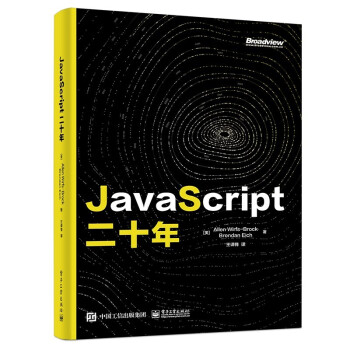

#JavaScriptTwenty Years

   

   

This project has cooperated with Bowen Viewpoint to launch a paper version, and 10% of its royalties will be donated to Mozilla, [click to buy](https://item.jd.com/13211336.html).

## Original introduction
This book is jointly written by Brendan Eich, the father of JavaScript, and Allen Wirfs-Brock, the lead author of the ES6 specification. It records and explains in detail the evolution of the JavaScript language over a total of 20 years from the birth of the language in 1995 to the formulation of the ES6 specification in 2015. The book not only explains the evolution of a large number of language technical details, but also reviews the historical successes and failures in specification formulation and standard games at a higher level. It is a story about how humans promote industrial development through competition and cooperation in business and technology. .

The story is quite long and complicated. The full text is divided into four parts, each corresponding to a major stage in the evolution of JavaScript. There is also a brief interlude between each section to introduce how developers at that time viewed and used JavaScript.

These four parts are as follows:

1. **[The Birth of the Language](./part-1.md)** (The Origins of JavaScript), introduces the creation and early development of JavaScript, including the language’s birth background, naming method, initial features and its design philosophy wait. This section also traces its initial evolution at Netscape and other companies, such as Microsoft's JScript.
2. **[Creating a Standard](./part-2.md)** (Creating a Standard) introduces the process from JavaScript to ECMAScript standard. This mainly covers the initiation of JavaScript standardization work, the creation of specifications, relevant contributors, and decision-making methods.
3. **[Failed Reformations](./part-3.md)** (Failed Reformations), which introduces the failed attempts of the ECMAScript committee to modify the language after Eich left, lacking a "benevolent dictator". This mainly involves committee splits, two rounds of investment in ES4, and the origins of Flash and ActionScript in it.
4. **[Carry on the past and open up the future](./part-4.md)** (Modernizing JavaScript), introduces the story behind the two successful standards of ES5 in 2009 and ES6 in 2015, mainly including the goals of ES5 and ES6, An introduction and review of major fundamental changes and important new features.

## Table of contents
* [The birth of language](./part-1.md)
   * [Prehistoric Era](./part-1.md#Prehistoric Era)
   * [Brendan Eich joins Netscape](./part-1.md#brendan-eich-joins Netscape)
   * [Mocha’s Story](./part-1.md#mocha-’s story)
   * [JavaScript 1.0 and 1.1](./part-1.md#javascript-10-and-11)
     * [JavaScript syntax](./part-1.md#javascript-syntax)
     * [Data type and expression](./part-1.md#Data type and expression)
     * [Object](./part-1.md#Object)
     * [Function object](./part-1.md#Function object)
     * [Built-in library](./part-1.md#Built-in library)
     * [Execution model](./part-1.md#Execution model)
     * [Confusing Behavior and Bug](./part-1.md#Confusing Behavior and-bug)
       * [Redundant Statement](./part-1.md#Redundant Statement)
       * [Implicit type conversion and `==` operator](./part-1.md#Implicit type conversion and --operator)
       * [32-bit arithmetic](./part-1.md#32-bit arithmetic)
       * [`this` keyword](./part-1.md#this-keyword)
       * [Arguments object](./part-1.md#arguments-object)
       * [Special processing for numerical attribute keys](./part-1.md#Special processing for numerical attribute keys)
       * [Attribute of original value](./part-1.md#Attribute of original value)
       * [HTML comments in JavaScript](./part-1.md#javascript-in-html-comments)
   * [Microsoft JScript](./part-1.md#Microsoft-jscript22)
   * [From Mocha to SpiderMonkey](./part-1.md#from-mocha-to-spidermonkey)
* [Interlude: Feng Ping was murdered](./part-1.md#Interlude: Feng Ping was murdered)
* [Creation Standard](./part-2.md)
   * [Find venue](./part-2.md#Find venue)
   * [First TC39 meeting](./part-2.md#First-tc39-meeting)
   * [Writing specifications](./part-2.md#Writing specifications)
   * [Naming Standard](./part-2.md#Naming Standard)
   * [ISO Fast Track](./part-2.md#iso-Fast Track)
   * [Definition ECMAScript 3](./part-2.md#define-ecmascript-3)
* [Interlude: JavaScript does not require Java](./part-2.md#Interlude javascript-java is not required)
   * [Preacher](./part-2.md#Preacher)
   * [Rich Internet Applications and AJAX](./part-2.md#Rich Internet Applications and-ajax)
   * [Browser Game Theory](./part-2.md#Browser Game Theory)
* [Reform failed](./part-3.md)
   * [Dissatisfied with success](./part-3.md#Dissatisfied with success)
   * [First attempt at ES4](./part-3.md#First attempt at -es4-)
   * [Another dead end](./part-3.md#Another dead end)
   * [Flash and ActionScript](./part-3.md#flash-and-actionscript)
   * [Second attempt at ES4](./part-3.md#Second attempt at -es4-)
     * [Reset TC39-TG1](./part-3.md#reset-tc39-tg1)
     * [Redesign ES4](./part-3.md#Redesign-es4)
     * [Resistance](./part-3.md#Resistance)
     * [Seeking Harmony](./part-3.md#Seeking Harmony)
* [Interlude: Take JavaScript Seriously](./part-3.md#Interlude Take JavaScript Seriously-javascript)
   * [JavaScript Performance Revolution](./part-3.md#javascript-Performance Revolution)
   * [CommonJS and Node.js](./part-3.md#commonjs-and-nodejs)
   * [Javascript that becomes a universal runtime for browsers](./part-3.md#-javascript that becomes a universal runtime for browsers)
* [Carry on the past and open up the future](./part-4.md)
   * [Develop ES3.1/ES5](./part-4.md#Develop-es31es5)
     * [ES5 Technical Design](./part-4.md#es5-Technical Design)
       * [Strict Mode](./part-4.md#strict mode)
       * [Getter, Setter and object meta-operations](./part-4.md#gettersetter-and object meta-operations)
       * [Integrity and security characteristics of objects](./part-4.md#Integrity and security characteristics of objects)
       * [Removal of Activation Object](./part-4.md#Removal of activation-object)
       * [Other ES5 features](./part-4.md#other-es5-features)
     * [Implementation and Testing](./part-4.md#Implementation and Testing 86)
   * [From Harmony to ECMAScript 2015](./part-4.md#from-harmony-to-ecmascript-2015)
     * [Start investing in Harmony](./part-4.md#Start investing in Harmony)
       * [Strawman and target](./part-4.md#strawman and target)
       * [Advocate Model](./part-4.md#Advocate Model)
       * [Select feature set](./part-4.md#Select feature set)
       * [Start writing specifications](./part-4.md#Start writing specifications)
       * [One JavaScript](./part-4.md#one-javascript)
       * [Brendan's Dream](./part-4.md#brendan-'s dream)
     * [Rebuild specification](./part-4.md#Rebuild specification)
       * [Reorganization specification structure](./part-4.md#Reorganization specification structure)
       * [New term](./part-4.md#New term)
       * [New semantic category](./part-4.md#New semantic category)
     * [ES2015 Language Features](./part-4.md#es2015-Language Features)
       * [Realms, Jobs, Proxies and Meta Object Programming (MOP)](./part-4.md#realmsjobsproxies-and Meta Object Programming mop)
       * [Block-level declaration scope](./part-4.md#Block-level declaration scope)
       * [Class](./part-4.md#Class)
       * [Module](./part-4.md#module)
       * [arrow function](./part-4.md#arrow function)
       * [Other features](./part-4.md#Other features)
       * [Deferred and abandoned features](./part-4.md#Deferred and abandoned features)
     * [Harmony translator](./part-4.md#harmony-translator)
     * [Complete ECMAScript 2015](./part-4.md#Complete-ecmascript-2015)
* [Summary](./part-4.md#Summary)
* [Acknowledgments](./part-4.md#Acknowledgements)
* [Appendices](./appendices.md)
   * [Character](./appendices.md#Character)
   * [Appendice Organization](./appendices.md#Appendice Organization)
   * [Glossary](./appendices.md#Glossary)
   * [Abbreviations and Acronyms](./appendices.md#Abbreviations and Acronyms)
   * [Timeline](./appendices.md#Timeline)
     * [Part 1: Birth of Language](./appendices.md#Part 1: Birth of Language)
     * [Part 2: Creating Standards](./appendices.md#Part 2: Creating Standards)
     * [Part 3: Reform Failure](./appendices.md#The third part of the reform failed)
     * [Part 4: Carry on the past and open up the future](./appendices.md#Part 4: Carry on the past and open up the future)
   * [JavaScript Release Announcement of December 4, 1995](./appendices.md#javascript-release-announcement of December 4, 1995)
* [Notes](./notes.md)
* [References](./references.md)

## License
This article is licensed under the [CC-BY-NC 4.0](https://creativecommons.org/licenses/by-nc/4.0/) license and does not restrict non-commercial reprinting.

Allen Wirfs-Brock and Brendan Eich. 2020. JavaScript: the first 20 years. Proc. ACM Program. Lang. 4, HOPL, Article 77 (June 2020), 189 pages. DOI: https://doi.org/10.1145/ 3386327
