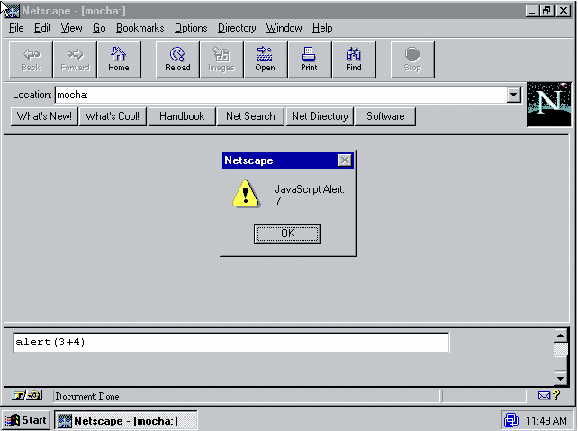

# Sự ra đời của ngôn ngữ

## Thời tiền sử
Khái niệm và công nghệ cơ bản của World Wide Web được tạo ra bởi Tim Berners-Lee [[2003](./references.md#tbl:history)] tại CERN từ năm 1989 đến năm 1991. Công nghệ web đã được lưu hành trong giới vật lý năng lượng cao trong nhiều năm, nhưng chưa tạo ra phản ứng mạnh mẽ bên ngoài cộng đồng vật lý. Cơ hội thực sự để nó thu hút sự chú ý là *Mosaic*<sup>[g](./appendices.md#Mosaic)</sup>, được phát triển vào năm 1992-1993. Ứng dụng này do sinh viên đại học Marc Andreessen và Eric Bina của Đại học Illinois tại Trung tâm Siêu máy tính Urbana-Champaign (NCSA) phát triển, về cơ bản xác định một danh mục phần mềm mới gọi là "trình duyệt web".

NCSA Khảm là một ứng dụng web không chỉ dễ cài đặt và sử dụng mà còn có giao diện đồ họa. Nó đã phổ biến khái niệm World Wide Web ra bên ngoài cộng đồng vật lý và lan truyền khá rộng rãi. Đến đầu năm 1994, vốn thương mại bắt đầu đổ xô tham gia làn sóng trình duyệt bằng cách cấp phép cho mã khảm hoặc phát triển các trình duyệt giống khảm từ đầu. Jim Clark, người sáng lập SGI (Silicon Valley Graphics Inc.), đã thu hút vốn đầu tư mạo hiểm và thuê Marc Andreessen và Eric Bina. Vào tháng 4 năm 1994, họ cùng nhau thành lập một công ty. Công ty, cuối cùng được đặt tên là Netscape, nhằm mục đích thay thế khảm bằng trình duyệt phổ biến nhất thế giới. Để đạt được mục tiêu này, Netscape đã phát triển trình duyệt Khảm thế hệ tiếp theo *Netscape Navigator*<sup>[g](./appendices.md#Netscape-Navigator)</sup> từ đầu, được phát hành vào tháng 10 năm 1994 . Đến đầu năm 1995, Netscape Navigator đã đạt được những mục tiêu ban đầu và nhanh chóng thay thế Khảm.

Trọng tâm công nghệ Web của Tim Berners-Lee là việc sử dụng ngôn ngữ đánh dấu HTML khai báo để mô tả tài liệu và hiển thị chúng dưới dạng trang web. Tuy nhiên, ngành này không quan tâm đến *ngôn ngữ kịch bản* có thể tạo điều kiện cho người dùng cuối sắp xếp các hoạt động ứng dụng. ], cũng cho thấy sự quan tâm đáng kể. Các ngôn ngữ này, chẳng hạn như Visual Basic trong Microsoft Office và AppleScript [[Cook 2007](./references.md#applescript)] của Apple, không được thiết kế để triển khai các cấu trúc dữ liệu và thành phần thuật toán phức tạp ở trung tâm của một ứng dụng. Thay vào đó, chúng cung cấp cho người dùng những cách mới để "gắn kết" các thành phần ứng dụng đó lại với nhau. Khi Netscape mở rộng đối tượng của mình trên World Wide Web, một câu hỏi quan trọng là liệu có nên tích hợp các ngôn ngữ kịch bản vào các trang web hay không và bằng cách nào.

### Brendan Eich gia nhập Netscape
Brendan Eich<sup>[4](./notes.md#4)</sup> tốt nghiệp thạc sĩ tại Đại học Illinois tại Urbana-Champaign năm 1985, sau đó ngay lập tức gia nhập SGI, chủ yếu làm việc trên nhân Unix và lớp mạng. Anh gia nhập MicroUnity vào năm 1992 sau khi rời SGI. Đây là một công ty mới nổi được tài trợ tốt chuyên phát triển bộ xử lý phương tiện video. Tại cả hai công ty, ông đã triển khai các ngôn ngữ nhỏ, chuyên biệt hỗ trợ các tác vụ lập trình mạng và kernel. Tại MicroUnity, anh ấy cũng đã thực hiện một số công việc trên GCC *compiler*<sup>[g](./appendices.md#compiler)</sup>.

Đầu năm 1995, Brendan Eich bị ấn tượng bởi chiêu trò "viết Lược đồ trên trình duyệt" <sup>[5](./notes.md#5)</sup> của Netscape và bỏ cuộc. Nhưng khi Eich gia nhập Netscape vào ngày 3 tháng 4 năm 1995, anh nhận thấy tình hình hiện tại của công ty về cả tiếp thị sản phẩm và ngôn ngữ lập trình đều phức tạp. Netscape đã từ chối lời đề nghị mua lại giá rẻ từ Microsoft vào cuối năm 1994. Kể từ đó, ban quản lý Netscape dự kiến ​​sẽ phải đối mặt với cuộc tấn công từ chiến lược "Ôm lấy, mở rộng và tuyệt chủng" của Microsoft [[Wikipedia 2019](./references.md#wikip:EEE)]. Dưới sự lãnh đạo trực tiếp của Gates, Microsoft đã nhanh chóng nhận ra rằng dự án Blackbird ứng dụng thông tin sinh thái khép kín sắp tới của họ [[Anderson 2007](./references.md#msft:blackbird)] sẽ được sử dụng dưới sự phát triển của Web đa nền tảng. Tầm thường. Do đó, bản ghi nhớ "Làn sóng Internet" của Gates [[Gates 1995](./references.md#gates:tidalwave)] đã chuyển hướng chiến lược của Microsoft từ Blackbird sang *Internet Explorer*<sup>[g](./appendices .md#Internet -Explorer)</sup> và một bộ sản phẩm máy chủ hoàn chỉnh để đối phó với cuộc vây hãm của Netscape.

Các lựa chọn thay thế cho ngôn ngữ viết kịch bản web bao gồm các ngôn ngữ định hướng nghiên cứu như Đề án, các ngôn ngữ dựa trên Unix thực tế như Perl/Python/Tcl và các ngôn ngữ độc quyền như Microsoft Visual Basic . Điều Brendan Eich muốn là triển khai Đề án trong trình duyệt. Nhưng vào đầu năm 1995, Sun (Sun Microsystems) bắt đầu một chiến dịch tiếp thị du kích cho <sup>[6](./notes.md#6)</sup> Java [[Bous 1998](. /references. md#javahist)]. Sun và Netscape nhanh chóng đạt được thỏa thuận tích hợp Java vào Netscape 2. Eich nhớ lại rằng khẩu hiệu của Marc Andreessen tại hội nghị Netscape là "Netscape cộng với Java sẽ giết chết Windows". Tại hội nghị Java của Sun vào ngày 23 tháng 5 năm 1995, Netscape công bố ý định cấp phép cho công nghệ Java của Sun [[Netscape 1995a](./references.md#netscape:press:java)] để sử dụng trong các trình duyệt.

Việc ra quyết định nhanh chóng này trong Netscape đã cản trở nghiêm trọng việc lựa chọn các ngôn ngữ lập trình kịch bản như Đề án/Perl/Python/Tcl/Visual Basic, vốn không khả thi xét từ góc độ lợi ích kinh doanh và/hoặc thời gian đưa ra thị trường. Đối với các giám đốc điều hành cấp cao tại Netscape và Sun, đặc biệt là Marc Andreessen và Bill Joy của Sun, họ tin rằng cách khả thi duy nhất là thiết kế và triển khai một "ngôn ngữ nhỏ" <sup>[7](./notes.md#7)< / sup> để bổ sung cho Java.

Những người hoài nghi về quyết định này chiếm đa số ở Sun và đa số ở Netscape. Họ đặt câu hỏi về sự cần thiết của một ngôn ngữ kịch bản đơn giản hơn như vậy: Java có phù hợp để viết kịch bản không? Làm thế nào để giải thích tại sao hai ngôn ngữ tốt hơn một? Netscape có chuyên môn để tạo ra các ngôn ngữ mới không?

Sự phản đối đầu tiên rất dễ bị bác bỏ. Java vào mùa xuân năm 1995 không phù hợp cho người mới bắt đầu, người ta phải đặt nội dung mã của chương trình chính Java bên trong khai báo gói *class*<sup>[g](./appendices.md#class)</sup> dưới tên Đối với *phương thức tĩnh*<sup>[g](./appendices.md#method)</sup> của `main`, bạn cũng phải khai báo *types*<sup>[g tĩnh cho tất cả các tham số, giá trị trả về và biến ](./appendices.md#type)</sup>. Đánh giá từ kinh nghiệm Visual Basic bổ sung cho Visual C++ và nhiều ngôn ngữ Unix bổ sung cho các thành phần mã gốc, có thể thấy rõ rằng Java không đủ đơn giản để "dán" người viết kịch bản.

Cơ sở để khắc phục phản đối thứ hai là tham chiếu đến các sản phẩm của Microsoft. Đối với các lập trình viên ứng dụng Windows chuyên nghiệp, Microsoft bán cho họ Visual C++. Và đối với những người có sở thích, lập trình viên bán thời gian, nhà thiết kế, kế toán và những người khác, Microsoft cung cấp Visual Basic làm ngôn ngữ kịch bản. Điều này cho phép các lập trình viên bán thời gian ít kinh nghiệm hơn có thể "dán" các thành phần tùy chỉnh được xây dựng bằng Visual C++. Một phiên bản Visual Basic có tên "Visual Basic for Application" (VBA) đã được tích hợp vào Microsoft Office để hỗ trợ các tiện ích mở rộng người dùng và nhu cầu viết kịch bản của các ứng dụng này.

Sau khi vượt qua hai sự phản đối đầu tiên, Marc Andreessen đề xuất tên mã "Mocha" cho ngôn ngữ kịch bản trình duyệt. Theo Eich, đề xuất này cũng hy vọng sẽ đổi tên ngôn ngữ thành "JavaScript" trong thời gian thích hợp. Ngôn ngữ phụ trợ Java này phải "trông giống Java", duy trì tính dễ sử dụng và "dựa trên đối tượng" thay vì dựa trên lớp như Java.

Chỉ còn lại một phản đối cuối cùng: Netscape có chuyên môn để tạo ra một ngôn ngữ kịch bản hiệu quả có thể đưa nó vào phiên bản Netscape 2 beta vào tháng 9 năm 1995 không? Brendan Eich đang thực hiện sứ mệnh chứng minh điều này bằng cách tạo ra Mocha.

###Câu chuyện của Mocha
Khi ngày phát hành Java đến gần, Brendan Eich tin rằng thời gian là điều cốt yếu. Một con chim trong tay có giá trị bằng hai con chim trong bụi rậm, vì vậy vào tháng 5 năm 1995, anh ấy đã dành mười ngày liên tục <sup>[8](./notes.md#8)</sup> cho *Mocha* <sup >[ đầu tiên của mình g](./appendices.md#Mocha)</sup> Triển khai nguyên mẫu. Công việc đã được hoàn thành đúng thời hạn nghiên cứu khả thi. Bản demo này bao gồm việc triển khai ngôn ngữ ở mức tối thiểu và được tích hợp tối thiểu vào phiên bản tiền alpha của trình duyệt Netscape 2.

Nguyên mẫu của Eich được phát triển trên máy trạm SGI Indy Unix [[Netfreak 2019](./references.md#sgiIndy)], sử dụng từ vựng viết tay và trình phân tích cú pháp gốc đệ quy. Trình phân tích cú pháp này phát ra các hướng dẫn mã byte thay vì cây phân tích cú pháp. Mã byte * trình thông dịch * <sup>[g](./appendices.md#interpreter)</sup> rất đơn giản và chậm <sup>[9](./notes.md#9)</sup>.

Tính năng mã byte phát sinh từ nhu cầu về máy chủ Netscape LiveWire <sup>[10](./notes.md#10)</sup> mà các nhà phát triển của nó muốn nhúng nó ngay cả trước khi Mocha được tạo nguyên mẫu. Cựu nhân viên kỹ thuật và quản lý Borland của nhóm tin tưởng vào tương lai của ngôn ngữ kịch bản động, nhưng họ muốn sử dụng mã byte thay vì phân tích cú pháp mã nguồn để tăng tốc độ tải ứng dụng máy chủ.

Marc Andreessen nhấn mạnh rằng Mocha phải dễ sử dụng đến mức bất kỳ ai cũng có thể viết trực tiếp vài dòng trong tài liệu HTML. Các giám đốc điều hành cấp cao tại Sun và Netscape nhắc lại yêu cầu rằng Mocha phải "trông giống Java", loại trừ rõ ràng những thứ giống BASIC. Nhưng vẻ ngoài giống Java này cũng mang đến những kỳ vọng về hành vi giống Java, điều này ảnh hưởng đến thiết kế mô hình *object*<sup>[g](./appendices.md#object)</sup> của ngôn ngữ. các kiểu nguyên thủy (chẳng hạn như `boolean` / `int` / `double` / `string`, v.v.).

Ngoài yêu cầu về ngoại hình giống Java, Brendan Eich được tự do lựa chọn hầu hết các chi tiết thiết kế ngôn ngữ. Sau khi gia nhập Netscape, anh đã khám phá một số ngôn ngữ "dễ sử dụng" và "dành cho giáo dục", bao gồm ngôn ngữ HyperTalk [[Apple Computer 1988](./references.md#apple1988hypercard)], ngôn ngữ Logo [[Papert 1980](. /references.md#logo)] và Ngôn ngữ bản thân [[Ungar và Smith 1987](./references.md#self)]. Mọi người đều đồng ý rằng Mocha sẽ "dựa trên đối tượng" nhưng không có lớp học. Bởi vì các lớp hỗ trợ sẽ mất nhiều thời gian và có nguy cơ cạnh tranh với Java. Để thừa nhận Bản thân, Eich đã chọn sử dụng cơ chế ủy quyền với một liên kết nguyên mẫu duy nhất để tạo mô hình đối tượng động. Anh nghĩ điều này sẽ tiết kiệm chi phí thực hiện, nhưng cuối cùng không có đủ thời gian để khám phá cơ chế trong nguyên mẫu Mocha.

Các đối tượng được tạo bằng cách áp dụng toán tử `new` cho *constructor*<sup>[g](./appendices.md#constructor-function)</sup>. Một hàm tạo đối tượng mặc định có tên là `Object`, được tích hợp trong môi trường cùng với các đối tượng tích hợp khác. Mỗi đối tượng bao gồm 0 hoặc nhiều thuộc tính. Mỗi *property*<sup>[g](./appendices.md#property)</sup> có một tên (còn được gọi là *property key*<sup>[g](./appendices.md#property- key )</sup>) và một giá trị, có thể là *function*<sup>[g](./appendices.md#function)</sup>, một đối tượng hoặc một trong một số loại dữ liệu tích hợp khác . Các thuộc tính mới có thể được tạo bằng cách gán giá trị cho các khóa thuộc tính không sử dụng. Các thuộc tính không có hạn chế về khả năng hiển thị hoặc gán và hàm tạo cũng có thể cung cấp một tập thuộc tính ban đầu. Sau khi đối tượng được tạo, các thuộc tính khác cũng có thể được thêm vào. Nhóm LiveWire đặc biệt thích cách tiếp cận rất năng động này.

Mặc dù sức hấp dẫn của Đề án đã phai nhạt, Brendan Eich vẫn thấy khái niệm giống Lisp về các hàm hạng nhất rất hấp dẫn. Bộ công cụ dành cho các hàm hạng nhất này được lấy cảm hứng rất nhiều từ thành ngữ Đề án, trong đó các phương thức không nhất thiết phải được đưa vào một lớp. Điều này bao gồm hỗ trợ cho các chương trình con cấp cao nhất, truyền các hàm dưới dạng đối số, phương thức trên đối tượng và trình xử lý sự kiện. Biểu thức hàm (còn gọi là *biểu thức lambda*<sup>[g](./appendices.md#lambda-express)</sup> hoặc đơn giản là lambda) đã bị trì hoãn do hạn chế về thời gian nhưng vẫn được giữ lại trong cú pháp . Trình xử lý sự kiện và phương thức đối tượng được thống nhất thông qua từ khóa `this` mượn từ Java (sau C++). Trong tất cả các hàm, nó được sử dụng để biểu diễn đối tượng bối cảnh khi hàm được gọi như một phương thức.

Được thúc đẩy bởi các cuộc thảo luận không chính thức với Marc Andreessen và một số kỹ sư đầu tiên của Netscape <sup>[11](./notes.md#11)</sup>, nguyên mẫu này đã hỗ trợ chức năng `eval`. Nó có thể phân tích và thực thi các chuỗi chứa chương trình. Theo trực giác, kiểu lập trình "chuỗi thành chương trình" động này rất quan trọng đối với một số ứng dụng nhất định trong trình duyệt web và máy chủ<sup>[12](./notes.md#12)</sup>. Tuy nhiên, quyết định ủng hộ `eval` đã gây ra hậu quả ngay lập tức. Một số trường hợp yêu cầu hàm dịch ngược mã nguồn của nó thành một chuỗi thông qua phương thức `toString` giống như Java. Vì lý do này, Eich đã chọn triển khai bộ dịch ngược mã byte trong vòng chạy nước rút 10 ngày <sup>[13](./notes.md#13)</sup>, bởi vì liệu mã nguồn có được đặt trong bộ nhớ chính (RAM hay không) ROM) hoặc Khôi phục từ bộ lưu trữ thứ cấp (đĩa cứng, v.v.) có thể quá tốn kém đối với một số kiến ​​trúc mục tiêu được hỗ trợ. Điều này đặc biệt đúng đối với các máy tính Windows 3.1 bị ràng buộc bởi mô hình bộ nhớ phân đoạn 16-bit Intel 8086. Bởi vì đối với các cấu trúc không bị giới hạn hoặc có kích thước lớn trong bộ nhớ, nhiều phân đoạn trong bộ nhớ cần được ghi đè và quản lý thủ công.

Sau mười ngày, nguyên mẫu đã được trình diễn tại cuộc họp toàn thể nhân viên kỹ thuật của Netscape (Hình 2). Cuộc trình diễn đã thành công, dẫn đến sự lạc quan quá mức về việc cung cấp một Netscape 2 hoàn chỉnh và tích hợp hơn. Phiên bản beta đầu tiên của Netscape 2 được lên kế hoạch phát hành vào tháng 9 năm đó. Công việc chính của Brendan Eich vào mùa hè năm đó là tích hợp Mocha đầy đủ hơn vào trình duyệt. Điều này đòi hỏi phải thiết kế và triển khai các API cho phép chương trình Mocha tương tác với các trang web. Đồng thời, anh ta cũng cần biến việc triển khai ngôn ngữ nguyên mẫu thành phần mềm có thể chuyển giao được và phản hồi các báo cáo lỗi, đề xuất thay đổi và yêu cầu tính năng từ những người dùng nội bộ ban đầu.

Để biết thêm chi tiết về câu chuyện mười ngày dẫn đến việc tạo ra Mocha, hãy xem câu chuyện kể lại của Brendan Eich [[Eich 2008c](./references.md#BrendanHistory08), [2011d](./references.md#BrendanHistory11); [JavaScript Jabber 2014] (./references.md#js-jabber:brendan); [Walker 2018](./references.md#jollyswagman:brendan)]. Mã nguồn của phiên bản sản xuất của Mocha cũng có sẵn trên Internet Archive [[Netscape 1997b](./references.md#netscape3.0.2)]. "Netscape Dorm" của Jamie Zawinski [[1999](./references.md#nscpdorm)] cũng mô tả việc làm việc như một nhà phát triển phần mềm Netscape trong thời kỳ này.

##JavaScript 1.0 và 1.1
Netscape và Sun đã phát hành JavaScript trong một thông cáo báo chí chung vào ngày 4 tháng 12 năm 1995 [[Netscape và Sun 1995](./references.md#netscape:press:javascript); Phụ lục F]. JavaScript được mô tả trong bản dự thảo là "một ngôn ngữ kịch bản đối tượng" có thể được sử dụng để viết các tập lệnh nhằm "sửa đổi các thuộc tính và hành vi của các đối tượng Java một cách linh hoạt". Nó sẽ phục vụ như một "sự bổ sung cho Java để tạo điều kiện phát triển ứng dụng trực tuyến". Mặc dù thiết kế kỹ thuật của họ chỉ có những điểm tương đồng bề ngoài, nhưng hai công ty đã cố gắng tạo ra sự kết nối thương hiệu mạnh mẽ giữa ngôn ngữ Java và JavaScript. Sự giống nhau về tên này và gợi ý rằng hai ngôn ngữ có liên quan chặt chẽ với nhau từ lâu đã gây ra sự nhầm lẫn.



Hình 2. Bảng điều khiển Mocha. Bản demo Mocha ban đầu của Brendan Eich thể hiện chức năng của "bảng điều khiển Mocha" chạy trong Netscape 2 pre-alpha trên máy trạm SGI Unix. Bảng điều khiển Mocha này về cơ bản đã được phát hành trong phiên bản chính thức của Netscape 2, ngoại trừ việc thay đổi tên. Đây là ảnh chụp màn hình Netscape 2.02 chạy trên Windows 95. Bảng điều khiển Mocha này có thể được kích hoạt bằng cách gõ `mocha:` vào thanh địa chỉ trình duyệt - phiên bản chính thức của Netscape 2 đã thay đổi thành `javascript:`, nhưng `mocha:` vẫn hoạt động. Sau khi kích hoạt bảng điều khiển, trình duyệt sẽ mở hai khung trang. Biểu thức Mocha được nhập vào hộp văn bản bên dưới sẽ được phản ánh ở trang trên sau khi đánh giá. Ví dụ này hiển thị việc gọi hàm `alert` tích hợp để nhận cửa sổ bật lên đánh giá một biểu thức. Cửa sổ bật lên của bản demo ban đầu hiển thị "Cảnh báo Mocha" thay vì "Cảnh báo JavaScript".

JavaScript, được phát hành dưới tên "LiveScript", được phát hành lần đầu tiên vào tháng 9 năm 1995 trong phiên bản beta đầu tiên của Netscape Navigator 2.0 [[Netscape 1995b](./references.md#netscape:nav:2.0b1:releasenotes)]. Tiếp theo phiên bản này là bốn phiên bản beta trước khi phát hành chính thức Navigator 2.0 vào tháng 3 năm 1996. Phiên bản chính thức này hỗ trợ JavaScript 1.0. Netscape Enterprise Server 2.0 cũng được phát hành vào tháng 3 [[Netscape 1996f](./references.md#netscape:press:server2.0)], tích hợp JavaScript 1.0 vào thành phần tập lệnh của máy chủ LiveWire của nó.

JavaScript là một tính năng tương đối nhỏ trong Netscape Navigator, do đó việc phát triển nó bị hạn chế bởi kế hoạch chung cho Navigator 2.0. Kế hoạch kêu gọi đóng băng tính năng vào tháng 8 năm 1995. Bộ tính năng của JavaScript 1.0 thực sự đã đánh dấu các tính năng đang được phát triển hoặc sắp được phát triển trong quá trình triển khai Mocha vào tháng 8 năm đó. Mặc dù Eich tiếp tục sửa các lỗi trong quá trình triển khai Mocha ban đầu trong suốt quá trình phát hành Navigator 2.0, nhưng bộ tính năng này vẫn chưa hoàn chỉnh so với thiết kế ngôn ngữ đã hình dung và vẫn còn nhiều lỗi khó khăn cũng như các điều kiện ranh giới. Brendan Eich đã được phỏng vấn ngay trước khi phát hành phiên bản 1.0 [[Shah 1996](./references.md#brendan96)], nơi ông phản hồi về vị trí chính thức của JavaScript như một tiện ích bổ sung cho Java và tính chất vội vã của bản phát hành đầu tiên:

> BE (Brendan Eich): Tôi hy vọng nó (JavaScript) có thể được các nhà cung cấp khác triển khai dựa trên đặc tả mà tôi và Bill Joy đang soạn thảo. Tôi muốn thấy nó vẫn ở quy mô nhỏ nhưng trở nên phổ biến trên web và trở thành cách ưa thích để gắn kết các hoạt động trên các phần tử HTML với các thành phần khác như ứng dụng Java.
>
> BE: ...theo như tôi biết thì công dụng phổ biến nhất là làm cho trang thông minh hơn và sinh động hơn. Ví dụ: bạn có thể tải một *URL*<sup>[g](./appendices.md#URL)</sup> khác khi bạn nhấp vào một liên kết, tùy thuộc vào thời gian trong ngày.
>
>…
>
> BE: Đã có ánh sáng cuối đường hầm. JavaScript vẫn chỉ là một chương trình dành cho một người và 2.0 (phiên bản Netscape Navigator, ghi chú của người dịch) sẽ chứa nhiều lỗi nhỏ khó chịu. Tôi hy vọng tất cả các lỗi chính đều có giải pháp và tôi đã dành nhiều thời gian làm việc với các nhà phát triển để tìm ra lỗi và giải pháp của họ.
>
> Tôi sẽ tiếp tục nỗ lực hướng tới phiên bản 2.1 bằng cách sửa lỗi, bổ sung các tính năng mới và cố gắng làm cho JavaScript nhất quán trên tất cả các nền tảng. Tôi không biết chính xác khi nào phiên bản 2.1 sẽ được phân phối nhưng tôi có thể đảm bảo rằng nó sẽ ra mắt vào mùa thu tới - chúng tôi đang tiến triển khá nhanh ở đây.

JavaScript 1.0 [[Netscape 1996d](./references.md#netscape:js1.0:handbook)] là một *được gõ động*<sup>[g](./appendices.md#dynamically-typed)< /sup > ngôn ngữ, hỗ trợ các giá trị số, chuỗi và boolean, các hàm công dân hạng nhất và các kiểu dữ liệu đối tượng. Về mặt cú pháp, JavaScript thuộc họ C giống như Java. Các câu lệnh luồng điều khiển của nó được mượn từ C và cú pháp biểu thức của nó cũng bao gồm hầu hết các toán tử số của C. JavaScript 1.0 có một thư viện nhỏ gồm các hàm dựng sẵn có mã nguồn thường được nhúng trực tiếp vào tệp HTML, nhưng thư viện tích hợp của nó bao gồm hàm `eval` có thể phân tích và đánh giá mã nguồn JavaScript được mã hóa thành một chuỗi. Nhìn chung, JavaScript 1.0 là một ngôn ngữ rất hợp lý. Hình 3 tóm tắt một số tính năng còn thiếu. Đối với các lập trình viên JavaScript hiện đại, việc bỏ sót các tính năng này có thể gây ngạc nhiên.

<table>
   <tr><td>Independent <code>Array</code> object type</td><td><code>Array</code> literal</td></tr>
   <tr><td>Regular expression</td><td>Object literal</td></tr>
   <tr><td>Global binding to <code>undefined</code></td><td><code>===</code> operator</td></tr>
   <tr><td><code>typeof</code>, <code>void</code>, <code>delete</code> operator</td><td><code>in</code>, <code>instanceof</code> operator</td></tr>
   <tr><td><code>do-while</code> statement</td><td><code>switch</code> statement</td></tr>
   <tr><td><code>try-catch-finally</code> statement</td><td><code>break</code>/<code>continue</code> to label</td>< /tr>
   <tr><td>Nested function declaration</td><td>Function expression</td></tr>
   <tr><td>The <code>call</code> and <code>apply</code> methods of the function</td><td>The <code>prototype</code> attribute of the function</td></ tr>
   <tr><td>Prototype-based inheritance</td><td>Access to built-in prototype objects</td></tr>
   <tr><td>Cyclic Garbage Collection<sup><a href="./appendices.md#cyclic-garbage-collection">g</a></sup></td><td>HTML <code> <code>src</code> attribute of &lt;script&gt;</code> tag</td></tr>
</table>

Hình 3. Các tính năng JavaScript thường được sử dụng không có trong JavaScript 1.0 (khoảng năm 2010).

Đầu năm 1996, quá trình phát triển Netscape Navigator 3.0, tên mã là "Atlas", bắt đầu [[Netscape 1996g](./references.md#netscape:nav:3.0b3:releasenotes)] và được phát hành vào tháng 8 năm 1996. Brendan Eich có thể tiếp tục phát triển các tính năng chưa hoàn thiện hoặc bị thiếu trong giai đoạn này khi tính năng đóng băng được phát hành cho phiên bản 2.0 vào tháng 8 năm 1995. Cho đến khi JavaScript 1.1 được phát hành trong Navigator 3.0 [[Netscape 1996a](./references.md#netscape:js1.1:newfeatures), [e](./references.md#netscape:js1.1:handbook)] Phiên bản đầu tiên định nghĩa và phát triển đã hoàn tất. Các phần sau phác thảo thiết kế của ngôn ngữ JavaScript 1.0/1.1.

### Cú pháp JavaScript
Cú pháp của JavaScript 1.0 trực tiếp dựa trên ngôn ngữ C [[ANSI </sup> Lấy cảm hứng từ ngôn ngữ [[Aho et al. 1988](./references.md#aho1988awk)]. Một script là một chuỗi các câu lệnh và tuyên bố. Không giống như C, các câu lệnh JavaScript không bị giới hạn xuất hiện trong các thân hàm. Trong JavaScript 1.0, mã nguồn tập lệnh được nhúng trong tài liệu HTML được bao quanh bởi các thẻ `<script></script>`.

Các câu lệnh lấy cảm hứng từ C trong JavaScript 1.0 bao gồm: câu lệnh biểu thức; câu lệnh `if` có điều kiện; vòng lặp `for` và `while`; câu lệnh `break`, `continue` và `return` cho luồng điều khiển không tuần tự; và câu lệnh Khối (hỗ trợ sử dụng một chuỗi các câu lệnh được phân tách bằng `{}` như thể chúng là một câu lệnh duy nhất). Câu lệnh `if`, `for` và `while` là câu lệnh ghép <sup>[14](./notes.md#14)</sup>. JavaScript 1.0 không bao gồm câu lệnh `do-while`, câu lệnh `switch`, nhãn câu lệnh và câu lệnh `goto` của C.

Dựa trên nhóm câu lệnh C cơ bản, JavaScript 1.0 đã thêm hai câu lệnh ghép để truy cập các thuộc tính của kiểu dữ liệu đối tượng của nó. Câu lệnh `for-in` lấy cảm hứng từ AWK có thể lặp lại *khóa thuộc tính*<sup>[g](./appendices.md#property-key)</sup> của đối tượng. Trong nội dung câu lệnh của câu lệnh `with` <sup>[15](./notes.md#15)</sup>, tên thuộc tính của một đối tượng có thể được truy cập dưới dạng một biến. Vì các thuộc tính có thể được thêm động (và bị xóa trong các phiên bản sau của ngôn ngữ), nên *bind*<sup>[g](./appendices.md#bind)</sup> của các biến hiển thị có thể thay đổi tương ứng với các thay đổi `with` trong quá trình thực thi trong phần thân của câu lệnh.

Các khai báo trong JavaScript không tuân theo kiểu C hoặc Java. JavaScript được nhập động và không có tên loại cấp độ ngôn ngữ làm tiền tố cú pháp để xác định các khai báo. Ngược lại, các khai báo JavaScript có tiền tố từ khóa. JavaScript 1.0 có hai dạng khai báo, khai báo `function` và khai báo `var`. Cú pháp của khai báo `function` <sup>[16](./notes.md#16)</sup> được mượn trực tiếp từ AWK, xác định tên, tham số chính thức và nội dung câu lệnh của một hàm có thể gọi được. Khai báo `var` có thể giới thiệu một hoặc nhiều liên kết biến và tùy ý gán giá trị cho các biến. Tất cả các khai báo `var` đều được coi là các câu lệnh và có thể xuất hiện trong bất kỳ ngữ cảnh câu lệnh nào, kể cả trong các khối câu lệnh. Trong JavaScript 1.0/1.1, việc khai báo hàm chỉ có thể xuất hiện ở cấp cao nhất của tập lệnh và việc lồng nhau không được hỗ trợ. Các khai báo `var` cũng có thể xuất hiện bên trong thân hàm. Các biến được xác định bởi các khai báo như vậy là các biến cục bộ của hàm.

Không giống như C, các khối câu lệnh của JavaScript 1.0 không đưa ra khái niệm về phạm vi khai báo. Trong một khối câu lệnh trong thân hàm, các khai báo `var` hiển thị cục bộ đối với toàn bộ thân hàm. Các khai báo `var` nằm trong các khối bên ngoài các hàm có *scope*<sup>[g](./appendices.md#scope)</sup> toàn cục. Nếu một giá trị được gán cho một tên biến không tồn tại trong phạm vi dưới dạng khai báo `function` hoặc `var`, thì một biến toàn cục có tên đó sẽ được tạo ngầm. Hành vi này hóa ra là một nguồn lỗi đáng kể, vì việc khai báo sai chính tả cũng âm thầm tạo ra một biến mới có tên sai.

Một điểm khác biệt quan trọng khác giữa JavaScript và cú pháp C truyền thống là việc xử lý dấu chấm phẩy ở cuối câu lệnh. C coi dấu chấm phẩy là dấu kết thúc câu lệnh bắt buộc, trong khi JavaScript cho phép bỏ qua dấu chấm phẩy khi nó là ký tự hợp lệ cuối cùng trên dòng. Các quy tắc chính xác cho hành vi này không có trong tài liệu JavaScript 1.0. "Sổ tay Netscape 2.0" không hiển thị dấu chấm phẩy khi mô tả các dạng câu lệnh JavaScript khác nhau. Nó chỉ nêu rằng "một câu lệnh có thể trải dài trên nhiều dòng. Nếu mỗi câu lệnh được phân tách bằng dấu chấm phẩy, nhiều câu lệnh có thể xuất hiện trên một dòng. Câu lệnh [[Netscape 1996d](./references.md#netscape:js1.0:handbook)]". Ví dụ về mã JavaScript trong hướng dẫn sử dụng sử dụng kiểu mã hóa không có dấu chấm phẩy, như minh họa bên dưới:

``` js
var a, x, y
var r = 10
with (Math) {
  a = PI * r * r
  x = r * cos(PI)
  y = r * sin(PI / 2)
}
```

Tính năng viết mã JavaScript không sử dụng dấu chấm phẩy này được gọi là chèn dấu chấm phẩy tự động (ASI). ASI vẫn còn gây tranh cãi giữa các lập trình viên JavaScript. Một số lượng đáng kể các lập trình viên vẫn thích viết mã theo kiểu không có dấu chấm phẩy, trong khi những người khác không bao giờ sử dụng ASI.

### Kiểu dữ liệu và biểu thức
JavaScript 1.0/1.1 là ngôn ngữ được gõ động với năm loại dữ liệu cơ bản: số, chuỗi, boolean, đối tượng và hàm. "Gõ động" ở đây có nghĩa là thông tin loại thời gian chạy được liên kết với từng phần dữ liệu, thay vì với "vùng chứa giá trị" chẳng hạn như biến. Kiểm tra loại thời gian chạy đảm bảo rằng các thao tác chỉ được áp dụng cho các giá trị dữ liệu được mỗi thao tác hỗ trợ.

Các giá trị Boolean, chuỗi và số là các giá trị bất biến. Kiểu Boolean có hai giá trị, `true` và `false`. Giá trị chuỗi bao gồm một chuỗi mã hóa ký tự 8 bit bất biến và không hỗ trợ Unicode. Kiểu số bao gồm tất cả các giá trị dấu phẩy động 64-bit nhị phân có thể có của IEEE 754 [[IEEE 2008](./references.md#ieee754)], ngoại trừ việc chỉ hiển thị giá trị `NaN` chuẩn . Một số thao tác nhất định xử lý các giá trị số tương ứng với "số nguyên 32 bit không dấu" và "số nguyên bù hai 32 bit có dấu". Mocha sử dụng các cách biểu diễn thay thế của các giá trị số nguyên như vậy trong nội bộ nhưng chỉ có một kiểu dữ liệu số chính thức.

JavaScript 1.0 có hai giá trị đặc biệt dùng để biểu thị "thiếu giá trị dữ liệu hữu ích". Các biến chưa được khởi tạo sẽ được đặt thành giá trị đặc biệt *không xác định*<sup>[17](./notes.md#17)</sup>. Đây cũng là giá trị được chương trình trả về khi nó cố gắng truy cập vào một thuộc tính chưa tồn tại trong đối tượng. Trong JavaScript 1.0, giá trị *không xác định* có thể nhận được bằng cách khai báo và truy cập các biến chưa được khởi tạo. Giá trị `null` nhằm mục đích biểu thị "không có đối tượng" trong ngữ cảnh dự kiến ​​có giá trị đối tượng. Nó được mô hình hóa theo giá trị `null` của Java và giúp tích hợp JavaScript với các đối tượng do Java triển khai. Trong suốt lịch sử, sự hiện diện của hai giá trị tương tự nhưng khác nhau đáng kể đã dẫn đến sự nhầm lẫn giữa các lập trình viên JavaScript, khiến nhiều người không chắc chắn nên sử dụng giá trị nào khi nào.

Cú pháp biểu thức của JavaScript 1.0 về cơ bản được sao chép từ C, sử dụng cùng một bộ toán tử và quy tắc ưu tiên. Các phần chính bị bỏ qua ở đây là các con trỏ và toán tử liên quan đến kiểu của C, cũng như toán tử `+` đơn nhất. Toán tử `+` nhị phân bị quá tải để thực hiện phép cộng số và nối chuỗi. Các toán tử logic shift và bitwise thực hiện các phép toán cấp bit trên số nguyên bù hai 32 bit có dấu. Nếu cần, các toán hạng được cắt ngắn thành số nguyên và giảm modulo xuống giá trị 32 bit. Toán tử `>>` thực hiện dịch chuyển phải số học mở rộng dấu trên giá trị số nguyên 32-bit. JavaScript cũng thêm toán tử `>>>>`, mượn từ Java, để thực hiện các ca dịch phải không dấu.

JavaScript 1.1 đã thêm các toán tử `delete`, `typeof` và `void`. Trong JavaScript 1.1, toán tử `delete` sẽ chỉ đặt toán hạng biến hoặc thuộc tính đối tượng tương ứng của nó thành giá trị `null`. Toán tử `typeof` trả về một chuỗi xác định kiểu nguyên thủy của toán hạng của nó. Các giá trị chuỗi có thể có bao gồm `"không xác định"`, `"đối tượng"`, `"hàm"`, `"boolean"`, `"chuỗi"`, `"số"` hoặc một ký tự được xác định bởi môi trường triển khai Một giá trị chuỗi để chỉ ra loại đối tượng máy chủ. Điều khó hiểu là `typeof null` trả về giá trị chuỗi `"object"` thay vì `"null"`. Trên thực tế, có thể nói điều này phù hợp với Java, vì mọi giá trị trong Java đều là đối tượng, và `null` thực chất là một đối tượng thể hiện "no object". Tuy nhiên, Java thiếu toán tử tương đương với toán tử `typeof` và sử dụng `null` làm giá trị mặc định cho các biến chưa được khởi tạo. Theo hồi ức của Brendan Eich, giá trị của `typeof null` là kết quả của sự rò rỉ tính trừu tượng trong quá trình triển khai Mocha ban đầu. Giá trị thời gian chạy của `null` được mã hóa bằng cách sử dụng cùng giá trị thẻ nội bộ với giá trị đối tượng, do đó việc triển khai toán tử `typeof` chỉ trả về `"object"` mà không cần xử lý đặc biệt bổ sung nào. Thực tiễn cho thấy sự lựa chọn này mang lại rất nhiều rắc rối cho các lập trình viên JavaScript. Họ thường muốn kiểm tra xem một giá trị có thực sự là một đối tượng hay không trước khi thử truy cập các thuộc tính của nó. Nhưng chỉ kiểm tra xem một giá trị có thuộc loại `"đối tượng"` hay không là không đủ để bảo vệ quyền truy cập thuộc tính, vì việc cố gắng truy cập thuộc tính `null` cũng sẽ tạo ra lỗi thời gian chạy.

Toán tử `void` chỉ đánh giá các toán hạng của nó và trả về *không xác định*. Cách phổ biến để truy cập *không xác định* là `void 0`. Toán tử `void` được giới thiệu như một công cụ hỗ trợ xác định các siêu liên kết HTML thực thi mã JavaScript khi được nhấp vào. Ví dụ:

``` html
<a href="javascript:void usefulFunction()">
  Click to do something useful
</a>
```

Ở đây giá trị của `href` *attribute*<sup>[g](./appendices.md#attribute)</sup> phải là một URL và `javascript:` là một giao thức URL đặc biệt được trình duyệt công nhận. Điều này có nghĩa là mã JavaScript phía sau được đánh giá và kết quả được chuyển đổi thành chuỗi sẽ được sử dụng, giống như tài liệu phản hồi được tìm nạp từ URL `href` thông thường. Trừ khi nhận được *không xác định*, phần tử `<a>` sẽ cố gắng tiếp tục xử lý tài liệu phản hồi. Thông thường, tất cả các nhà phát triển web đều muốn đánh giá một biểu thức JavaScript khi nhấp vào liên kết. Việc thêm tiền tố vào một biểu thức bằng `void` cho phép nó được sử dụng theo cách này, tránh việc xử lý thêm phần tử `<a>`.

Sự khác biệt lớn nhất giữa các biểu thức C và JavaScript là các toán tử JavaScript tự động chuyển đổi toán hạng của chúng thành các kiểu dữ liệu trong miền của toán tử. JavaScript 1.1 đã thêm cơ chế có thể định cấu hình để chuyển đổi các đối tượng tùy ý thành giá trị số hoặc chuỗi. Hình 4 tóm tắt các quy tắc chuyển đổi kiểu ẩn (ép buộc) của JavaScript 1.1.

<table>
  <thead>
    <tr><th>From - To</th><th>function</th><th>object</th><th>number</th><th>boolean</th><th>string</th></tr>
  </thead>
  <tbody>
    <tr><td><b>undefined</b></td><td>error</td><td>null</td><td>error</td><td>false</td><td><code>"undefined"</code></td></tr>
    <tr><td><b>function</b></td><td>N/C</td><td>Function object</td><td>valueOf/error</td><td>valueOf/true</td><td>decompile</td></tr>
    <tr><td><b>object (not null)</b></td><td>Function object</td><td>N/C</td><td>valueOf/error</td><td>valueOf/true</td><td>toString/valueOf<sup>1</sup></td></tr>
    <tr><td><b>object (null)</b></td><td>error</td><td>N/C</td><td>0</td><td>false</td><td><code>"null"</code></td></tr>
    <tr><td><b>number (zero)</b></td><td>error</td><td>null</td><td>N/C</td><td>false</td><td><code>"0"</code></td></tr>
    <tr><td><b>number (nonzero)</b></td><td>error</td><td>Number</td><td>N/C</td><td>true</td><td>default</td></tr>
    <tr><td><b>number (NaN)</b></td><td>error</td><td>Number</td><td>N/C</td><td>false<sup>2</sup></td><td><code>"NaN"</code></td></tr>
    <tr><td><b>number (+Infinity)</b></td><td>error</td><td>Number</td><td>N/C</td><td>true</td><td><code>"+Infinity"</code></td></tr>
    <tr><td><b>number (-Infinity)</b></td><td>error</td><td>Number</td><td>N/C</td><td>true</td><td><code>"-Infinity"</code></td></tr>
    <tr><td><b>boolean (false)</b></td><td>error</td><td>Boolean</td><td>0</td><td>N/C</td><td><code>"false"</code></td></tr>
    <tr><td><b>boolean (true)</b></td><td>error</td><td>Boolean</td><td>1</td><td>N/C</td><td><code>"true"</code></td></tr>
    <tr><td><b>string (empty)</b></td><td>error</td><td>String</td><td>error<sup>3</sup></td><td>false</td><td>N/C</td></tr>
    <tr><td><b>string (non-empty)</b></td><td>error</td><td>String</td><td>number/error</td><td>true</td><td>N/C</td></tr>
  </tbody>
</table>

* If the results are separated by slashes, it means that JavaScript will try the former first and use the latter if unsuccessful.
* **N/C** means No Conversion Necessary.
* **decompile** represents a string containing the unique source code of the function.
* **toString** represents the result of calling the toString method.
* **valueOf** represents the result of calling the valueOf method when it can return a value for the target type.
* **number** represents the corresponding numerical value when the string is a valid integer or floating-point number literal.
* <sup>1</sup> If valueOf does not return a string, do the default object-to-string conversion.
* <sup>2</sup> In JavaScript 1.1 used by Navigator 3.0, NaN is converted to true.
* <sup>3</sup> In JavaScript 1.1 used by Navigator 3.0, empty strings are converted to 0.

Hình 4. Các quy tắc chuyển đổi loại ẩn do Eich và McKinney đề xuất trong đặc tả ban đầu của JavaScript 1.1 [[1996](./references.md#TC39:1996:002), trang 23], các quy tắc tiêu chuẩn hóa cuối cùng hơi khác một chút so với cái này . Đây là bản sao của bảng gốc, với một số khác biệt nhỏ về mặt chữ. Chú thích 3 không xuất hiện trong văn bản gốc.

### Sự vật
Đối tượng JavaScript 1.0 là các mảng kết hợp có các phần tử được gọi là thuộc tính. Mỗi thuộc tính có một khóa chuỗi và một giá trị, có thể là bất kỳ loại dữ liệu JavaScript nào. Thuộc tính có thể được thêm vào một cách linh hoạt. JavaScript 1.0/1.1 không hỗ trợ xóa thuộc tính khỏi đối tượng.

Miễn là chuỗi khóa của thuộc tính tuân thủ các quy tắc cú pháp cho mã định danh, thì nó có thể được truy cập bằng cách sử dụng ký hiệu dấu chấm có dạng `obj.prop0`. Tất cả các thuộc tính có thể được truy cập bằng cách sử dụng ký hiệu ngoặc, bao gồm cả những thuộc tính có khóa không tuân theo quy tắc về mã định danh. Biểu thức nằm trong dấu ngoặc vuông được đánh giá và chuyển đổi thành một chuỗi được dùng làm khóa thuộc tính. Ví dụ: khi `n` có giá trị là `0`, `obj["prop" + n]` tương đương với `obj.prop0`. Việc gán cho một thuộc tính không tồn tại sẽ tạo ra một thuộc tính mới và việc truy cập một thuộc tính không tồn tại thường trả về *không xác định*. Nhưng trong JavaScript 1.0/1.1, nếu bạn sử dụng ký hiệu dấu ngoặc vuông để truy cập giá trị thuộc tính không tồn tại và khóa thuộc tính là biểu diễn chuỗi của một số nguyên không âm, thì giá trị `null` sẽ được trả về.

Các thuộc tính có thể được sử dụng vừa làm nơi lưu trữ dữ liệu vừa để liên kết hành vi với các đối tượng. Các thuộc tính có giá trị là hàm có thể được gọi là phương thức trên đối tượng. Một hàm được gọi là phương thức đối tượng có thể truy cập đối tượng thông qua liên kết động của từ khóa `this`.

Để tạo đối tượng, bạn có thể áp dụng toán tử `new` cho hàm dựng sẵn hoặc hàm do người dùng xác định. Các hàm dự định sử dụng theo cách này được gọi là hàm tạo. Các nhà xây dựng thường thêm thuộc tính vào các đối tượng mới. Các thuộc tính này có thể là dữ liệu hoặc phương thức. Hàm tạo tích hợp `Object` có thể được sử dụng để tạo các đối tượng mới ban đầu không có thuộc tính. Hình 5 cho thấy cách tạo một đối tượng mới bằng cách sử dụng hàm tạo `Object` hoặc hàm tạo do người dùng định nghĩa.

``` js
//Use Object constructor
var p1 = new Object;
p1.x = 0;
p1.y = 0;

//Use custom constructor
function Point(x, y) {
   this.x = x;
   this.y = y;
}
var p2 = new Point(0, 0);
```

Hình 5. Các cách khác để tạo đối tượng trong JavaScript 1.0. Các thuộc tính có thể được thêm sau khi đối tượng được tạo bằng `Object` hoặc chúng có thể được thêm khi đối tượng được tạo thông qua một hàm tạo tùy chỉnh.

JavaScript 1.0 cũng có hàm tạo `Array` tích hợp, nhưng chỉ có một sự khác biệt rõ ràng giữa các đối tượng được tạo bằng cách sử dụng hàm tạo `Object` và `Array` và đó là chuỗi gỡ lỗi được hiển thị cho đối tượng (ở dạng `" [ object Object]"`, v.v., ghi chú của người dịch). Trong JavaScript 1.0, các đối tượng được tạo bởi hàm tạo `Array` không có thuộc tính `length`.

Hành vi lập chỉ mục giống như mảng có thể đạt được trên bất kỳ đối tượng nào bằng cách tạo các thuộc tính có giá trị nguyên làm khóa. Các đối tượng như vậy cũng có thể có các thuộc tính tương ứng với các khóa không nguyên:


``` js
var a = new Object; // or new Array
a[0] = "zero";
a[1] = "one";
a[2] = "two";
a.length = 3;
```

Không có khái niệm về đối tượng *inheritance*<sup>[g](./appendices.md#inheritance)</sup> trong JavaScript 1.0. Chương trình phải thêm tất cả các thuộc tính cho từng đối tượng mới một cách riêng biệt, thường bằng cách xác định một hàm tạo cho từng đối tượng lớp được chương trình sử dụng. Hình 6 thể hiện sự trừu tượng hóa Point đơn giản dựa trên định nghĩa JavaScript 1.0.

``` js
// Define functions to be used as methods
function ptSum(pt2) {
   return new Point(this.x + pt2.x, this.y + pt2.y);
}
function ptDistance(pt2) {
   return Math.sqrt(Math.pow(pt2.x - this.x, 2) + Math.pow(pt2.y - this.y, 2));
}

//Define Point constructor
function Point(x, y) {
   //Create and initialize the data properties of the new object
   this.x = x;
   this.y = y;

   //Add methods to each object instance
   this.sum = ptSum;
   this.distance = ptDistance;
}
var origin = new Point(0, 0); // Create Point object
```

Hình 6. Sử dụng tính năng trừu tượng hóa Điểm được xác định trong JavaScript 1.0, mỗi đối tượng phiên bản có các thuộc tính phương thức riêng.

Những điều quan trọng cần lưu ý trong ví dụ này là:

* Mỗi phương thức phải được xác định là một hàm hiển thị toàn cục. Tên của hàm như vậy là bắt buộc và không được xung đột với các tên được sử dụng để xác định các hàm phương thức trừu tượng giống lớp khác (`ptSum`, `ptDistance`).
* Khi xây dựng một đối tượng, bạn phải tạo một thuộc tính đối tượng cho mỗi phương thức và khởi tạo giá trị của nó cho hàm toàn cục tương ứng.
* Phương thức này được gọi thông qua tên thuộc tính (`origin.distance`) thay vì tên toàn cục đã khai báo (`ptDistance`).

JavaScript 1.1 loại bỏ nhu cầu tạo thuộc tính phương thức trực tiếp trên mỗi phiên bản mới. Nó liên kết đối tượng *prototype*<sup>[g](./appendices.md#prototype)</sup> với hàm tạo thông qua thuộc tính của đối tượng hàm có tên là `prototype`. Hướng dẫn JavaScript 1.1 [[Netscape 1996e](./references.md#netscape:js1.1:handbook)] mô tả `prototype` là "thuộc tính được chia sẻ bởi tất cả các đối tượng thuộc loại đó". Đây là một mô tả mơ hồ, một tuyên bố tốt hơn có thể là thế này: nguyên mẫu là một đối tượng đặc biệt có các thuộc tính được chia sẻ với tất cả các đối tượng được tạo bởi hàm tạo.

Không có lời giải thích nào thêm về cơ chế chia sẻ này, nhưng có thể thấy rằng đối tượng nguyên mẫu có những đặc điểm sau:

* Khi truy cập một thuộc tính đối tượng, nếu tên của thuộc tính này đã được xác định trên "nguyên mẫu được liên kết với hàm tạo đối tượng", thì giá trị thuộc tính của đối tượng nguyên mẫu sẽ được trả về.
* Các bổ sung hoặc sửa đổi đối với thuộc tính của đối tượng nguyên mẫu sẽ hiển thị ngay lập tức đối với các đối tượng hiện có được tạo thông qua "hàm tạo được liên kết với nguyên mẫu".
* Khi gán giá trị cho thuộc tính đối tượng, nó sẽ *shadow*<sup>[g](./appendices.md#shadow)</sup><sup>[18](./notes.md#18)< /sup> trong Giá trị thuộc tính có cùng tên được xác định trên nguyên mẫu được liên kết với hàm tạo của đối tượng.

Đối với đối tượng `Object.prototype` tích hợp của ngôn ngữ, tất cả các thuộc tính của nó có thể có được thông qua quyền truy cập thuộc tính trên bất kỳ đối tượng nào, trừ khi thuộc tính đã bị đối tượng hoặc nguyên mẫu của nó che khuất.

Hình 7 thể hiện định nghĩa trừu tượng hóa Point đơn giản của Hình 6 trong JavaScript 1.1.

``` js
// Define functions to be used as methods
function ptSum(pt2) {
   return new Point(this.x + pt2.x, this.y + pt2.y);
}
function ptDistance(pt2) {
   return Math.sqrt(Math.pow(pt2.x - this.x, 2) + Math.pow(pt2.y - this.y, 2));
}

//Define Point constructor
function Point(x, y) {
   //Create and initialize the data properties of the new object
   this.x = x;
   this.y = y;
}

// Add methods to the shared prototype object
Point.prototype.sum = ptSum;
Point.prototype.distance = ptDistance;

var origin = new Point(0, 0); // Create Point object
```

Hình 7. Tính trừu tượng hóa điểm được xác định bằng JavaScript 1.1. Các đối tượng phiên bản kế thừa các phương thức từ đối tượng `Point.prototype`, thay vì xác định các thuộc tính phương thức trên mỗi phiên bản.

Sự khác biệt ở đây là phương thức này chỉ được gắn một lần trên đối tượng nguyên mẫu, thay vì lặp đi lặp lại khi mỗi đối tượng mẫu được xây dựng. Các thuộc tính được đối tượng nguyên mẫu cung cấp cho một đối tượng được gọi là * thuộc tính kế thừa * <sup>[g](./appendices.md#inherited-property)</sup>, trong khi các thuộc tính được xác định trực tiếp trên đối tượng được gọi là * Thuộc tính riêng* <sup>[g](./appendices.md#own-property)</sup>. Thuộc tính sở hữu làm lu mờ các thuộc tính được thừa kế có cùng tên.

Thuộc tính của các đối tượng nguyên mẫu thường là các phương thức. Trong trường hợp này, nguyên mẫu do hàm tạo cung cấp phục vụ cùng mục đích như vtable trong C++ hoặc MethodDictionary trong Smalltalk, nhằm liên kết hành vi chung với một tập hợp các đối tượng. Hàm tạo thực sự hoạt động như một đối tượng lớp và nguyên mẫu của nó tương đương với một thùng chứa chia sẻ các phương thức với các thể hiện của lớp. Đây là cách giải thích hợp lý về mô hình đối tượng JavaScript 1.1, nhưng chắc chắn không phải là cách giải thích duy nhất.

Việc đặt tên cho thuộc tính nguyên mẫu của hàm tạo cho thấy rõ rằng Brendan Eich đã nghĩ đến một mô hình đối tượng thay thế. Mô hình này được lấy cảm hứng từ ngôn ngữ lập trình Self [[Ungar and Smith 1987](./references.md#self)]. Trong Self, các đối tượng mới được tạo bằng cách sao chép một phần các loại đối tượng nguyên mẫu nhất định. Mỗi bản sao có một liên kết `cha mẹ` quay lại nguyên mẫu của nó, để nguyên mẫu có thể cung cấp chức năng được chia sẻ giữa tất cả các bản sao của nó. Mô hình đối tượng của JavaScript 1.1 có thể được coi là một biến thể của mô hình Self. Trong một nguyên mẫu, đối tượng nguyên mẫu có thể được truy cập gián tiếp thông qua hàm tạo và toán tử `new` sẽ sao chép một phiên bản mới từ nguyên mẫu. Các phiên bản nhân bản này sẽ *kế thừa*<sup>[g](./appendices.md#inherit)</sup> chức năng thường được chia sẻ trên các thuộc tính của đối tượng nguyên mẫu. Một số lập trình viên JavaScript gọi cơ chế này là "kế thừa nguyên mẫu <sup>[g](./appendices.md#prototypal-inheritance)</sup>". Đây là một hình thức cơ chế ủy quyền. Một số lập trình viên JavaScript cũng sử dụng khái niệm được trích dẫn là "kế thừa cổ điển <sup>[g](./appendices.md#classical-inheritance)</sup>" để chỉ khái niệm được sử dụng trong Java và nhiều ngôn ngữ hướng đối tượng khác. Kế thừa phong cách.

Tài liệu JavaScript 1.1 [[Netscape 1996e](./references.md#netscape:js1.1:handbook)] không mô tả đầy đủ hai mô hình đối tượng này. Nó duy trì một câu chuyện tiếp thị nhất quán với thông cáo báo chí của Netscape/Sun tháng 12 năm 1995. JavaScript được định vị là ngôn ngữ dành cho "các tương tác đối tượng kịch bản" và định nghĩa thực tế về trừu tượng hóa đối tượng (định nghĩa lớp) sẽ được viết bằng Java. Tại thời điểm này, khả năng trừu tượng hóa đối tượng của JavaScript gốc bị giới hạn ở các tính năng nhỏ. Những đặc điểm nhỏ này chỉ thu hút được ít sự chú ý và nhiều đặc điểm không được ghi chép lại.

### Đối tượng hàm
Trong JavaScript 1.0/1.1, định nghĩa hàm sẽ tạo và đặt tên cho hàm có thể gọi được. Các hàm JavaScript là các giá trị đối tượng hạng nhất. Tên được cung cấp trong khai báo `function` được định nghĩa là một biến toàn cục, tương tự như khai báo `var` trong mã cấp cao nhất. Giá trị của nó là một đối tượng hàm có thể được gán cho một biến, được đặt làm giá trị thuộc tính, được truyền dưới dạng tham số trong lệnh gọi hàm và được sử dụng làm giá trị trả về của hàm. Vì hàm cũng là đối tượng nên các thuộc tính cũng có thể được xác định trên chúng. Ví dụ sau đây cho thấy cách thêm thuộc tính vào đối tượng hàm:

``` js
function countedHello() {
   alert("Hello, World!");
   countedHello.callCount++; // Increase the callCount attribute of the function
}
countedHello.callCount = 0; //Associate the counter with the function
for (var i = 0; i < 5; i++) countedHello();
alert(countedHello.callCount); // Display 5
```

Các hàm cần được khai báo bằng danh sách tham số hình thức. Tuy nhiên, kích thước của danh sách tham số không giới hạn số lượng tham số có thể được truyền khi gọi hàm. Nếu số lượng tham số thực tế (tham số thực tế, đối số) được truyền khi gọi hàm nhỏ hơn số lượng tham số chính thức được khai báo (tham số chính thức, tham số), thì các tham số chính thức bổ sung sẽ được đặt thành *không xác định*. Nếu số lượng tham số thực tế được truyền vượt quá số lượng tham số chính thức, thì các tham số thực tế bổ sung sẽ được đánh giá, nhưng những giá trị này không thể lấy được thông qua tên tham số chính thức. Tuy nhiên, trong quá trình thực thi phần thân hàm, bạn cũng có thể sử dụng một đối tượng đối số giống mảng làm giá trị của thuộc tính `arguments` của đối tượng hàm. Tất cả các đối số thực tế được truyền khi gọi một hàm đều có sẵn dưới dạng các thuộc tính có khóa số nguyên của đối tượng `arguments`. Bằng cách này, các hàm có danh sách tham số có độ dài thay đổi có thể được hỗ trợ.

### Thư viện tích hợp
JavaScript 1.0 đi kèm với một thư viện gồm các hàm, đối tượng và hàm tạo dựng sẵn. Trong số các đối tượng phổ biến <sup>[19](./notes.md#19)</sup> và các hàm được xác định bởi thư viện này, một số lượng nhỏ là phổ biến, trong khi một số lượng lớn là dành riêng cho máy chủ. Trong Netscape Navigator, *đối tượng máy chủ* <sup>[g](./appendices.md#host-object)</sup> cung cấp một mô hình đại diện cho một phần của tài liệu HTML hiện tại. Các API này cuối cùng được gọi là Mô hình đối tượng tài liệu cấp 0 (DOM) [[Koch 2003](./references.md#dom0); [Netscape 1996b](./references.md#navdom0)]. Đối với Netscape Enterprise Server, đối tượng máy chủ hỗ trợ giao tiếp giữa máy khách và máy chủ, quản lý trạng thái phiên giữa máy khách và máy chủ, đồng thời truy cập các tệp và cơ sở dữ liệu. Thiết kế này của các đối tượng được lưu trữ phía máy chủ chưa được áp dụng bên ngoài các sản phẩm máy chủ của Netscape.

Thiết kế ban đầu của JavaScript chủ yếu được thúc đẩy bởi nhu cầu của nền tảng trình duyệt. Trong tài liệu Netscape dành cho các phiên bản JavaScript trước đó, không có sự phân biệt rõ ràng giữa việc các phần tử trong thư viện được dự định là "độc lập với máy chủ" hay "phụ thuộc vào máy chủ". Tuy nhiên, thiết kế, sự phát triển và tiêu chuẩn hóa của DOM và các API nền tảng trình duyệt khác là những câu chuyện quan trọng của riêng chúng. Bài viết này sẽ chỉ đề cập đến các vấn đề liên quan đến trình duyệt khi chúng liên quan đến thiết kế tổng thể của JavaScript.

JavaScript 1.0 chỉ có hai lớp đối tượng chung là `String` và `Date`. Ngoài ra, còn có một đối tượng toàn cục đơn lẻ `Math`, có thuộc tính là các hằng số và hàm toán học thường được sử dụng.

Trong các chương trình JavaScript 1.0, cũng có thể thấy các hàm tạo cho một số lớp không hoạt động hoặc được triển khai chưa đầy đủ, miễn là chương trình biết cách truy cập chúng.

JavaScript 1.1 triển khai các tính năng này và ghi lại sự tồn tại của chúng. Hình 8 tóm tắt các lớp độc lập với máy chủ được xác định trong JavaScript 1.0 và 1.1.

<table>
  <thead>
    <tr><th colspan="2">基础对象</th><th colspan="2">属性</th></tr>
    <tr><th>1.0</th><th>1.1</th><th>1.0</th><th>1.1 新增</th></tr>
  </thead>
  <tbody>
    <tr><td colspan="2">(global functions)</td><td>eval, isNaN<sup>1</sup>, parseFloat<sup>2</sup>, parseInt<sup>2</sup></td><td></td></tr>
    <tr><td><del>Array</del><sup>3</sup></td><td>Array</td><td></td><td>join, reverse, sort, toString</td></tr>
    <tr><td><del>Boolean</del><sup>3</sup></td><td>Boolean</td><td></td><td>toString</td></tr>
    <tr><td>Date</td><td></td><td>getDate, getDay, getHours, getMinutes, getMonth, getSeconds, getTime, getTimezoneOffset, getYear, setDate, setHours, setMinutes, setMonth, setSeconds, setTime, setYear, toGMTString, toLocaleString, Date.parse, Date.UTC</td><td>toString</td></tr>
    <tr><td colspan="2">(function objects)</td><td>arguments, length, caller</td><td></td></tr>
    <tr><td><del>Function</del><sup>3</sup></td><td>Function</td><td></td><td>prototype, toString</td></tr>
    <tr><td>Math</td><td></td><td>E, LN2, LN10, LOG2E, LOG10E, PI, SQRT1_2, SQRT2, abs, acos, asin, atan, ceil, cos, exp, floor, log, max, min, pow, random<sup>1</sup>, round, sin, sqrt, tan</td><td></td></tr>
    <tr><td>Object</td><td></td><td></td><td>constructor, eval, toString, valueOf</td></tr>
    <tr><td><del>Number</del><sup>3</sup></td><td>Number</td><td></td><td>toString, Number.NaN, Number.MAX_VALUE, Number.MIN_VALUE, Number.NEGATIVE_INFINITY, Number.POSITIVE_INFINITY</td></tr>
    <tr><td colspan="2">(string values)</td><td>length</td><td></td></tr>
    <tr><td></td><td>String</td><td>charAt<sup>4</sup>, indexOf, lastIndexOf, <del>split</del><sup>3</sup>, substring, toLowerCase, toUpperCase, (plus 13 HTML wrapper methods)</td><td>split, toString, valueOf</td></tr>
  </tbody>
</table>

* <sup>1</sup> chỉ khả dụng trên nền tảng Unix phiên bản 1.0.
* <sup>2</sup> hoạt động khác nhau trong phiên bản 1.0 tùy thuộc vào hệ điều hành máy chủ.
* <sup>3</sup> tồn tại ở phiên bản 1.0 nhưng thiếu chức năng hoặc có lỗi.
* <sup>4</sup> Trong 1.0, các phương thức này là thuộc tính của giá trị chuỗi. Trong 1.1 chúng là thuộc tính của String.prototype.

Hình 8. Thư viện tích hợp độc lập với máy chủ trong JavaScript 1.0/1.1.

Lớp `String` cung cấp thuộc tính `length` và 6 phương thức chung hoạt động trên các giá trị chuỗi bất biến, trả về các giá trị chuỗi mới khi thích hợp. Lớp `String` của JavaScript 1.0 cũng bao gồm 13 phương thức để gói các giá trị chuỗi bằng các thẻ HTML khác nhau. Ví dụ này minh họa ranh giới mờ nhạt giữa "các tính năng dành riêng cho máy chủ" và "các tính năng chung" trong JavaScript 1.0/1.1. JavaScript 1.0 không cung cấp hàm tạo `String` toàn cục, tất cả các giá trị chuỗi được tạo bằng cách sử dụng chuỗi ký tự, toán tử hoặc hàm tích hợp. JavaScript 1.1 đã thêm hàm tạo `String` và phương thức `split` toàn cục.

Lớp `Date` được sử dụng để biểu thị ngày và giờ theo lịch. `Date` của JavaScript 1.0 được triển khai trực tiếp theo lớp `java.util.Date` trong Java 1.0 [[Gosling et al. 1996](./references.md#jls)] và thậm chí các lỗi vẫn nhất quán. Điều này bao gồm các chi tiết mã hóa như sử dụng các giá trị thời gian có độ phân giải mili giây tập trung vào ngày 1 tháng 1 năm 1970 00:00:00 GMT, đánh số bên ngoài các tháng từ 0-11 và sự hiện diện của số 2000 trong năm thiết kế Java không rõ ràng. Lý do cơ bản cho quyết định thiết kế này là nhu cầu về khả năng tương tác với Java. Các phương thức Java duy nhất bị loại trừ là `bằng`, `trước` và `sau`. Không cần sử dụng chúng ở đây, vì JavaScript có khả năng chuyển đổi kiểu ẩn (ép buộc tự động) và bạn có thể sử dụng trực tiếp các toán tử quan hệ số với các đối tượng Date.

Ngoài `Object`, `Date` là hàm tạo tích hợp duy nhất có sẵn trong JavaScript 1.0. Ngoài các phương thức cá thể của lớp, `Date` cũng là lớp duy nhất hiển thị các phương thức trên đối tượng hàm tạo. Các lớp dành riêng cho trình duyệt đó không hiển thị các hàm tạo.

Các thuộc tính của đối tượng được cung cấp bởi các thư viện và máy chủ tích hợp có các thuộc tính đặc biệt. Các thuộc tính này không có sẵn trong các thuộc tính do người lập trình JavaScript tùy chỉnh. Ví dụ: một số thuộc tính phương thức không được liệt kê bởi câu lệnh `for-in` và một số thuộc tính bị toán tử `delete` bỏ qua hoặc có giá trị chỉ đọc. Việc truy cập hoặc sửa đổi một số thuộc tính này sẽ tạo ra hành vi đặc biệt với các tác dụng phụ có thể nhìn thấy được.

JavaScript 1.1 đã cung cấp lớp `Array`. Đối tượng được tạo bởi hàm tạo `Array` có thể được sử dụng để biểu diễn nhiều vectơ không đồng nhất được lập chỉ mục theo số nguyên và bắt đầu từ 0. Các phần tử mảng được biểu diễn dưới dạng thuộc tính đối tượng và khóa của chúng là biểu diễn chuỗi của các chỉ số nguyên dưới dạng của chúng. Các đối tượng mảng cũng có thuộc tính `length`, giá trị của thuộc tính này được khởi tạo bởi hàm tạo. Giá trị của thuộc tính `length` được cập nhật bất cứ khi nào chỉ mục phần tử lớn hơn hoặc bằng giá trị `length` hiện tại được truy cập. Do đó, số phần tử của một đối tượng mảng có thể tăng lên một cách linh hoạt.

###Mô hình thực thi
Trong Netscape 2 và các trình duyệt mới hơn, các trang HTML có thể chứa nhiều phần tử `<script>`. Sau khi trang được tải, trình duyệt sẽ tạo môi trường thực thi JavaScript mới và bối cảnh chung cho tài liệu HTML. Bối cảnh chung bao gồm một đối tượng toàn cục có các khóa thuộc tính bao gồm tên của các hàm và biến dựng sẵn (được cung cấp bởi các thư viện dựng sẵn JavaScript và môi trường máy chủ), cũng như các biến và hàm toàn cục được xác định trong tập lệnh.

Trong Netscape 2, mã JavaScript bên trong mỗi phần tử `<script>` được phân tích cú pháp và đánh giá từng phần tử theo thứ tự chúng xuất hiện trong tệp HTML của trang. Trong các trình duyệt sau này, phần tử `<script>` cũng có thể được đánh dấu để hỗ trợ đánh giá trì hoãn. Điều này cho phép trình duyệt tiếp tục xử lý HTML trong khi chờ mã JavaScript được yêu cầu từ mạng. Nhưng trong cả hai trường hợp, trình duyệt sẽ chỉ đánh giá một tập lệnh tại một thời điểm. Các tập lệnh thường chia sẻ cùng một đối tượng chung. Các biến và hàm toàn cục được tạo bởi một tập lệnh sẽ hiển thị cho tất cả các tập lệnh tiếp theo. Mỗi tập lệnh sẽ chạy đến khi hoàn thành mà không bị ưu tiên hoặc bị gián đoạn. Tính năng này của các trình duyệt đời đầu đã trở thành nguyên tắc cơ bản của JavaScript. Tập lệnh là đơn vị thực thi cơ bản. Việc thực thi từng tập lệnh, sau khi bắt đầu, sẽ tiếp tục cho đến khi hoàn thành. Bên trong tập lệnh, bạn không phải lo lắng về việc thực thi đồng thời các tập lệnh khác vì điều đó sẽ không xảy ra.

Netscape 2 cũng giới thiệu khái niệm khung trang Web <sup>[20](./notes.md#20)</sup>. Khung là một khu vực của trang web mà tài liệu HTML riêng biệt có thể được tải vào đó. Tất cả các khung trên trang đều có chung môi trường thực thi JavaScript và mỗi khung có bối cảnh chung riêng biệt trong môi trường này. Các tập lệnh được tải trong các khung trang khác nhau tương ứng với các đối tượng toàn cục khác nhau, các đối tượng tích hợp khác nhau cũng như các biến và hàm toàn cục khác nhau. Tuy nhiên, bối cảnh toàn cầu không có không gian địa chỉ độc lập. Môi trường thực thi JavaScript tương ứng với một không gian địa chỉ duy nhất để lưu trữ các đối tượng, được chia sẻ giữa tất cả các khung trang trong môi trường. Vì tất cả các đối tượng đều nằm trong cùng một không gian địa chỉ, nên các tham chiếu đến các đối tượng có thể được truyền cho nhau thông qua mã JavaScript trong các khung trang khác nhau, do đó trộn lẫn các đối tượng từ các bối cảnh chung khác nhau. Điều này có thể dẫn đến hành vi không mong muốn. Ví dụ JavaScript 1.1 trong Hình 9 minh họa điểm này.

``` js
// Just evaluate in other page frames new Object()
// This will make the alien variable refer to the object created there
var alien = createNewObjectInADifferentFrame();
var native = new Object(); // Create an object in the current page frame
Object.prototype.sharedProperty = "each frame has distinct built-ins";
alert(native.sharedProperty); // each frame has distinct built-ins
alert(alien.sharedProperty); // undefined
```

Hình 9. Ví dụ JavaScript 1.1 cho thấy các đối tượng có thể tương tác với nhau ngay cả khi các khung HTML khác nhau có các đối tượng tích hợp khác nhau.

Mỗi khung trang có một hàm tạo `Object` và `Object.prototype` độc lập. Chúng cung cấp các thuộc tính được kế thừa bởi tất cả các đối tượng được tạo bởi hàm tạo này. Việc thêm một thuộc tính vào `Object.prototype` của khung trang không làm cho thuộc tính này hiển thị với các đối tượng được tạo bởi hàm tạo `Object` trong các khung trang khác.

Các trang web JavaScript tương tác là các ứng dụng hướng sự kiện. Vòng lặp sự kiện được thực hiện bởi trình duyệt. HyperCard [[Apple Computer 1988](./references.md#apple1988hypercard)] đã truyền cảm hứng cho khái niệm sử dụng các sự kiện của Brendan Eich trong thiết kế Netscape 2 DOM [[Netscape 1996c](./references.md#navscripting)] ban đầu của ông. Ban đầu, các sự kiện chủ yếu được kích hoạt bởi sự tương tác của người dùng. Nhưng trong các trình duyệt hiện đại có nhiều loại sự kiện, chỉ một số trong đó bắt nguồn từ người dùng.

Sau khi tất cả các tập lệnh do trang web xác định đã được thực thi, môi trường JavaScript của trang vẫn hoạt động, chờ các sự kiện xảy ra. Trình xử lý sự kiện có thể được liên kết với các đối tượng do trình duyệt cung cấp, bao gồm nhiều đối tượng DOM. Trình xử lý sự kiện là một hàm JavaScript có thể được gọi để phản hồi khi xảy ra sự kiện. Việc gán một hàm cho một số thuộc tính cụ thể của đối tượng trình duyệt sẽ làm cho hàm đó trở thành một trình xử lý sự kiện được liên kết với thuộc tính đó. Ví dụ: các đối tượng tương ứng với các thiết bị trỏ có thể nhấp (chuột) có thuộc tính `onclick` có thể cài đặt. Bạn cũng có thể sử dụng một đoạn mã JavaScript để xác định trình xử lý sự kiện JavaScript trực tiếp trong phần tử HTML. Ví dụ:

``` html
<button onclick="doSomethingWhenClicked()">
   Click me
</button>
```

Sau khi xử lý phần tử HTML, trình duyệt sẽ tạo một hàm JavaScript và gán cho nó giá trị thuộc tính `onclick` của đối tượng nút. Đoạn mã `onclick` sẽ được sử dụng làm nội dung hàm. Khi một sự kiện được trình xử lý sự kiện JavaScript xử lý xảy ra, sự kiện đó sẽ được đặt vào nhóm sự kiện đang chờ xử lý. Khi không có mã JavaScript nào được thực thi, trình duyệt sẽ nhận một sự kiện đang chờ xử lý từ nhóm sự kiện và gọi hàm được liên kết với nó. Giống như tập lệnh, các hàm xử lý sự kiện chạy cho đến khi hoàn thành.

### Hành vi và lỗi khó hiểu
JavaScript có một số thuộc tính lạ hoặc không mong đợi. Một số trong số đó là có chủ ý và một số là sản phẩm của các quyết định thiết kế nhanh chóng được đưa ra trong đợt chạy nước rút 10 ngày đầu tiên của Mocha. JavaScript 1.0 cũng có lỗi và các tính năng chưa hoàn thiện.

#### Tuyên bố dư thừa
JavaScript cho phép nhiều khai báo có cùng tên trong một phạm vi. Tất cả các tên biến có cùng tên được khai báo bên trong hàm sẽ tương ứng với cùng một ràng buộc biến. Liên kết này có thể nhìn thấy được trong toàn bộ thân hàm. Ví dụ: sau đây là định nghĩa hàm hợp lệ:

``` js
function f(x, x) { // x corresponds to the second formal parameter, the first x is ignored
   var x; // Same binding as the second parameter
   for (var x in obj) { // Same binding as the second parameter
     var x = 1, x = 2; // Same binding as the second parameter
   }
   var x = 3; // Same binding as the second parameter
}
```

Tất cả các khai báo `var` trong hàm `f` sẽ trỏ đến cùng một liên kết biến, đó là liên kết của tham số chính thức thứ hai của hàm. Tên giống nhau có thể xuất hiện nhiều lần trong danh sách tham số của hàm. Trước khi thực thi phần nội dung hàm, các biến được xác định bởi khai báo `var` sẽ được khởi tạo thành *không xác định*, ngoại trừ các biến `var` có cùng tên với tên tham số chính thức. Trong trường hợp này, giá trị ban đầu của biến sẽ giống với tham số thực tế được truyền cho tham số chính thức có cùng tên. Quá trình khởi tạo khai báo `var` (bao gồm cả khai báo dư thừa) có ngữ nghĩa tương tự như "gán giá trị cho biến được khởi tạo". Chúng được thực thi theo thứ tự thực thi thông thường trong thân hàm khi chúng đến (giai đoạn khởi tạo).

Có thể có nhiều khai báo `hàm` có cùng tên trong một tập lệnh. Khi điều này xảy ra, khai báo hàm cuối cùng có tên đó sẽ được đưa lên đầu tập lệnh và biến toàn cục được khởi tạo với tên đó. Tất cả các khai báo `hàm` khác có cùng tên sẽ bị bỏ qua. Nếu có cả khai báo `function` toàn cục và khai báo `var` toàn cục có cùng tên, thì cả hai đều trỏ đến cùng một biến. Tất cả các khai báo `var` với bộ khởi tạo sẽ ghi đè các giá trị hàm khi gặp bộ khởi tạo (tức là một chữ) trong luồng thực thi.

#### Chuyển đổi loại ngầm định và toán tử `==`
Chuyển đổi loại ngầm định được thiết kế để giảm rào cản ban đầu đối với việc áp dụng JavaScript làm ngôn ngữ tập lệnh đơn giản. Nhưng khi JavaScript phát triển thành ngôn ngữ có mục đích chung, nó đã chứng tỏ là nguồn gây nhầm lẫn và lỗi mã hóa đáng kể, đặc biệt là đối với toán tử `==`. Một số quy tắc chuyển đổi có vấn đề đã được thêm vào Mocha sau lần chạy nước rút 10 ngày đầu tiên, ban đầu là để đáp ứng yêu cầu của người dùng alpha nhằm đơn giản hóa việc tích hợp JavaScript với HTTP/HTML. Ví dụ: người dùng nội bộ tại Netscape đã yêu cầu sử dụng `==` để so sánh mã trạng thái HTTP chứa giá trị chuỗi `"404"` với số 404. Họ cũng yêu cầu các chuỗi trống phải được tự động chuyển đổi thành `0` trong ngữ cảnh số, do đó cung cấp các giá trị mặc định cho các trường trống trong biểu mẫu HTML. Các quy tắc chuyển đổi loại này đưa ra một số điều bất ngờ, chẳng hạn như `1 == '1'` và `1 == '1.0'`, nhưng `'1' != '1.0'`.

JavaScript 1.0 cũng coi toán tử `=` là `==` trong phần xác nhận của câu lệnh `if`. Ví dụ:

``` js
// JavaScript 1.0-1.2
if (a = 0) alert("true"); // These two statements are equivalent
if (a == 0) alert("true");
```


#### số học 32-bit
Các toán tử logic bitwise của JavaScript hoạt động trên các giá trị 32 bit được mã hóa dưới dạng số dấu phẩy động kép IEEE. Các toán tử theo bit trước tiên cắt bớt số nguyên và sau đó thực hiện chuyển đổi modulo trên toán hạng của chúng trước khi thực hiện phép toán theo bit, dẫn đến giá trị bù hai 32 bit. Do đó, một giá trị số `x` có thể bị ép buộc thành giá trị 32-bit thông qua biểu thức `x|0`, trong đó `|` là toán tử OR logic theo bit. Dựa trên phương pháp này, chúng ta có thể thực hiện phép cộng có dấu 32 bit như sau:

``` js
function int32bitAdd(x, y) {
   return ((x | 0) + (y | 0)) | 0; // Addition with result truncated to 32 bits
}
```

Một mẫu tương tự có thể được sử dụng để thực hiện các phép toán số học 32-bit không dấu, nhưng trong trường hợp này, nên sử dụng toán tử dịch chuyển phải không dấu `>>0` thay vì `|0`.

#### từ khóa `this`
Mọi hàm đều có một tham số `this` ẩn. Khi gọi một hàm như một phương thức, tham số này được đặt thành đối tượng được sử dụng để truy cập phương thức. Điều này có cùng ý nghĩa với `this` (hoặc `self`) trong hầu hết các ngôn ngữ hướng đối tượng. Nhưng JavaScript sử dụng một dạng định nghĩa duy nhất giữa "các phương thức được liên kết với đối tượng" và "các hàm độc lập". Điều này đã gây ra sự nhầm lẫn và lỗi cho nhiều lập trình viên.

Khi gọi trực tiếp một hàm mà không xác định đối tượng, `this` sẽ được đặt ngầm thành đối tượng chung. Các thuộc tính của đối tượng toàn cục bao gồm tất cả các biến toàn cục của chương trình. Do đó, khi gọi trực tiếp một hàm, tham chiếu thuộc tính được xác định bởi `this` tương đương với tham chiếu đến một biến toàn cục. Vì quá trình xử lý `this` phụ thuộc vào cách gọi hàm nên cùng một tham chiếu `this` có thể có ý nghĩa khác nhau trong các trường hợp gọi khác nhau. Ví dụ:


``` js
function setX(value) {
   this.x = value;
}
var obj = new Object;
obj.setX = setX; // Use setX as a method of obj

obj.setX(42); // Call setX as a method
alert(obj.x); // Display 42

setX(84); // Call setX directly
alert(x); // Get global variable x, display 84
alert(obj.x); // Display 42
```

`this` gây thêm nhầm lẫn vì một số HTML ngầm chuyển đổi các đoạn mã JavaScript thành các hàm được gọi là phương thức. Ví dụ:

``` html
<button name="B" onclick="alert(this.name + ' clicked')">
   Nhấp vào đây
</button>
```

Khi trình xử lý sự kiện được thực thi, nó sẽ kích hoạt phương thức `onclick` của nút. Tại thời điểm này, `this` trỏ đến đối tượng nút và `this.name` sẽ lấy giá trị của thuộc tính `name` của nó.

#### Đối tượng đối số
Đối tượng `arguments` của hàm được gắn với các tham số hình thức của nó - có một ánh xạ động giữa các thuộc tính chỉ mục số của đối tượng `arguments` và các tham số hình thức của hàm. Các thay đổi đối với thuộc tính đối tượng `arguments` cũng thay đổi giá trị của các tham số hình thức tương ứng. Và bạn có thể thấy rằng những thay đổi đối với các tham số chính thức cũng sẽ có hiệu lực trên các thuộc tính đối tượng `arguments` tương ứng:


``` js
// JavaScript 1.0-1.1
f(1, 2);
function f(argA, argB) {
   alert(argA); // display 1
   alert(f.arguments[0]); // Display 1
   f.arguments[0] = "one";
   alert(argA); // display one
   argB = "two";
   alert(f.arguments[1]); // display two
   alert(f.arguments.argB); // display two
}
```

Như được hiển thị ở dòng cuối cùng của ví dụ trên, các tham số chính thức cũng có thể được truy cập bằng cách sử dụng tên của chúng làm khóa thuộc tính của đối tượng `arguments`.

Về mặt khái niệm, khi một hàm được gọi, một đối tượng `arguments` mới sẽ được tạo cho hàm được kích hoạt và giá trị của thuộc tính `arguments` của đối tượng hàm phải được đặt thành đối tượng `arguments` mới này. Nhưng trong JavaScript 1.0/1.1, các đối tượng hàm và đối tượng `arguments` là cùng một đối tượng:


``` js
// JavaScript 1.0-1.1
function f(a, b) {
   if (f == f.arguments) alert("f and f.arguments are the same object");
}
if (f.arguments == null) alert("but only while a call to f is active");
```

Lý tưởng nhất là đối tượng `đối số` của hàm chỉ có thể được truy cập trong thân hàm của nó. Điều này được thực hiện một phần bằng cách tự động đặt thuộc tính `arguments` của hàm thành `null` khi lệnh gọi hàm trả về. Nhưng giả sử có hai hàm `f1` và `f2`. Nếu `f1` gọi `f2`, thì `f2` có thể truy cập các tham số thực tế của `f1` bằng cách đánh giá `f1.arguments`.

Đối tượng `arguments` cũng có một thuộc tính gọi là `caller`. Giá trị của thuộc tính `caller` này là đối tượng hàm "đã kích hoạt lệnh gọi hàm hiện tại". Nhưng nếu đó là lệnh gọi hàm ngoài cùng thì giá trị này là `null`. Bằng cách sử dụng `người gọi` và `đối số`, bất kỳ hàm nào cũng có thể kiểm tra hàm và các đối số của nó trên ngăn xếp cuộc gọi hiện tại và thậm chí sửa đổi các giá trị tham số chính thức của hàm trên ngăn xếp cuộc gọi. Ngoài ra còn có một thuộc tính `caller` có cùng ý nghĩa có thể được truy cập trực tiếp thông qua đối tượng hàm mà không cần thông qua đối tượng `arguments`.

#### Xử lý đặc biệt các khóa thuộc tính số
Trong JavaScript 1.0, dấu ngoặc vuông có ngữ nghĩa khác thường khi được sử dụng với các khóa số nguyên. Trong một số trường hợp, các khóa số nguyên có dấu ngoặc vuông truy cập các thuộc tính của đối tượng một cách tuần tự theo thứ tự chúng được tạo. Nếu thuộc tính có khóa đó không tồn tại trên đối tượng và giá trị nguyên n nhỏ hơn tổng số thuộc tính đối tượng thì đối tượng sẽ được truy cập bằng cách sử dụng thứ tự thuộc tính. Trong trường hợp này, thuộc tính thứ n được tạo trên đối tượng (bắt đầu từ 0) sẽ được truy cập, ví dụ:

``` js
// JavaScript 1.0
var a = new Object; // or new Array
a[0] = "zero";
a[1] = "one";
a.p1 = "two";

alert(a[2]); // display two
a[2] = "2";
alert(a.p1); // Display 2
```

JavaScript 1.1 đã loại bỏ cách xử lý đặc biệt này đối với dấu ngoặc vuông.

#### Thuộc tính của giá trị gốc
Trong JavaScript 1.0, số và giá trị Boolean không có thuộc tính. Và khi cố gắng truy cập chúng hoặc gán thuộc tính cho chúng, một thông báo lỗi sẽ xuất hiện. Các giá trị chuỗi hoạt động giống như các đối tượng có thuộc tính, nhưng chúng đều có chung bộ thuộc tính và giá trị, ngoại trừ thuộc tính `length` chỉ đọc. Ví dụ:

``` js
// JavaScript 1.0
"xyz".prop = 42; // Set the prop attribute of all strings to 42
alert("xyz".prop); // Display 42
alert("abc".prop); // Display 42
```

Trong JavaScript 1.1, khi thực hiện truy cập thuộc tính hoặc gán cho một số, giá trị Boolean hoặc chuỗi, một "đối tượng trình bao bọc" được tạo ngầm bằng cách sử dụng hàm tạo Số/Boolean/Chuỗi tích hợp sẵn. Quyền truy cập thuộc tính được thực hiện trên trình bao bọc và các thuộc tính kế thừa thường được truy cập từ nguyên mẫu tích hợp sẵn của chúng. Chuyển đổi loại được thực hiện bằng lệnh gọi tự động đến phương thức `valueOf` và `toString` cho phép sử dụng trình bao bọc làm giá trị nguyên thủy trong hầu hết các trường hợp. Bạn cũng có thể tạo các thuộc tính mới trên đối tượng bao bọc bằng cách gán các giá trị. Nhưng các trình bao bọc được tạo ngầm thường không thể truy cập được ngay sau khi gán. Ví dụ:

``` js
// JavaScript 1.1
"xyz".prop = 42; // Set the prop property of the string wrapper to 42
alert("xyz".prop); // Implicitly create another wrapper, display undefined
var abc = new String("abc"); // Explicitly create a wrapper object

alert(abc + "xyz"); // Implicitly convert the wrapper to a string and display abcxyz
abc.prop = 42; // Create a property on the wrapper object
alert(abc.prop); // Display 42
```

#### Nhận xét HTML trong JavaScript
Các vấn đề tiềm ẩn về khả năng tương tác JavaScript trong Netscape 2 phát sinh từ những gì trình duyệt Netscape 1 và Khảm thực hiện khi chúng gặp phần tử HTML `<script>`. Các trình duyệt cũ hơn nhưng vẫn được sử dụng rộng rãi hiển thị phần nội dung `<script>` dưới dạng văn bản, đây là mã nguồn JavaScript thực tế khi hiển thị một trang web. Trong các trình duyệt này, bạn có thể tránh điều này bằng cách bao quanh phần nội dung của tập lệnh bằng các nhận xét HTML <sup>[21](./notes.md#21)</sup>. Ví dụ:

``` html
<!-- Mosaic and Netscape 1 -->
<script>
   <!-- This is the HTML comment that wraps the script body
     alert("this is a message from JavaScript"); // Invisible to older browsers
     //End HTML comment on next line
   -->
</script>
```

Dựa trên chế độ mã hóa này, trình phân tích cú pháp HTML trong Netscape 1 và Khảm sẽ nhận dạng toàn bộ nội dung tập lệnh dưới dạng nhận xét HTML mà không hiển thị nó. Nhưng theo cách triển khai Mocha ban đầu, điều này sẽ ngăn trình duyệt phân tích cú pháp tập lệnh thành JavaScript vì dấu phân cách của các nhận xét HTML là cú pháp không hợp lệ trong mã JavaScript. Để tránh vấn đề này, Brendan Eich đã hỗ trợ JavaScript 1.0 `<!--` làm phần đầu của nhận xét một dòng, tương đương với `//`. Anh ấy đã không tạo `-->` một dấu tách nhận xét JavaScript được công nhận, vì chỉ cần đặt trước nó bằng `//` là đủ. Bằng cách này, có thể đạt được sự hỗ trợ tương thích ngược cho các tập lệnh, như minh họa bên dưới:

``` html
<!-- Mosaic, Netscape 1, and Netscape 2 with JavaScript 1.0 -->
<script>
   <!-- This is both an HTML comment in older browsers and a JS single-line comment
   alert("this is a message from JavaScript"); // Invisible to older browsers
   // The next line not only ends the HTML comment, but also is a JS single-line comment
   //-->
</script>
```

Mặc dù các nhận xét `<!--` không được ghi lại dưới dạng cú pháp JavaScript chính thức, nhưng các nhà phát triển web đã sử dụng chúng và việc triển khai JavaScript của các trình duyệt khác hỗ trợ nó. Kết quả là `<!--` trên thực tế đã trở thành *Web Reality*<sup>[g](./appendices.md#Web-Reality)</sup>. Hai mươi năm sau, vào năm 2015, nó cuối cùng đã được thêm vào tiêu chuẩn ECMAScript—và Web Reality luôn là người có tiếng cười cuối cùng.

## Microsoft JScript<sup>[22](./notes.md#22)</sup>
Trong cùng tuần mà Netscape và Sun phát hành công khai JavaScript, Microsoft thông báo rằng họ có ý định biến Visual Basic thành "tiêu chuẩn để tạo các ứng dụng World Wide Web sử dụng Visual Basic Script" [[Wingfield 1995](./references.md#infoworld:1995 :12:11 )]. Microsoft chính thức công bố hỗ trợ JavaScript trong thông cáo báo chí của Internet Explorer 3.0 Beta [[Microsoft 1996](./references.md#microsoft:pressIE3beta)] vào ngày 29 tháng 5 năm 1996:

> **Tập lệnh ActiveX**. Với sự hỗ trợ riêng cho Visual Basic® Script và JavaScript, Microsoft Internet Explorer 3.0 cung cấp khả năng tạo tập lệnh độc lập với ngôn ngữ, toàn diện nhất. Microsoft Internet Explorer có thể được mở rộng với sự hỗ trợ cho các ngôn ngữ kịch bản lệnh khác, chẳng hạn như REXX, CGI và PERL. Các nhà thiết kế web có thể chèn bất kỳ ngôn ngữ kịch bản nào vào mã HTML để tạo các trang tương tác gắn kết các điều khiển ActiveX, ứng dụng Java và các thành phần phần mềm khác với nhau.

Sự phát triển của JScript bắt đầu vào tháng 10 năm 1995 khi Robert Welland gia nhập nhóm Microsoft Internet Explorer (IE). Welland trước đây đã làm việc trên máy tính cầm tay Newton của Apple và ngôn ngữ lập trình NewtonScript [[Smith 1995](./references.md#Smith:1995:UPL:217838.217844)]. NewtonScript là một ngôn ngữ hướng đối tượng dựa trên nguyên mẫu có thiết kế chịu ảnh hưởng của ngôn ngữ Self. Welland đã hợp tác chặt chẽ với Walter Smith, nhà thiết kế chính của NewtonScript và David Ungar, nhà tư vấn của dự án, vì vậy Welland rất quen thuộc với ý tưởng của Self và Ungar về một ngôn ngữ dựa trên nguyên mẫu. Sau khi rời Apple, Welland đã suy nghĩ về cách thêm tập lệnh vào trình duyệt, điều này dẫn đến việc anh được tuyển dụng để triển khai khả năng viết tập lệnh của Internet Explorer.

Khi Robert Welland đến Microsoft, ông được thông báo rằng Visual Basic nên được đưa vào IE, nhưng khi ông và bộ phận công cụ dành cho nhà phát triển DevDiv của Microsoft <sup>[g](./appendices.md#DevDiv)</sup >Khi Visual Nhóm cơ bản đã thảo luận về vấn đề này, họ nói sẽ mất hai năm. Vì vậy, anh và Sam McKelvie đã nhanh chóng cố gắng làm cho VBA<sup>[23](./notes.md#23)</sup> hoạt động được trong IE 2, nhưng nhận thấy rằng nó quá phức tạp để hoạt động với các đối tượng của trình duyệt. . Welland đã nghiên cứu LiveScript/JavaScript trong phiên bản beta công khai của Netscape 2 và bắt đầu thử triển khai một trình thông dịch mã byte đơn giản cho JavaScript, sau này McKelvie đã cải tiến trình này. Welland phát hiện ra rằng Peter Kukol thuộc bộ phận DevDiv đã viết một trình phân tích cú pháp JavaScript <sup>[24](./notes.md#24)</sup> có thể được sử dụng để tạo mã byte. Vì vậy, Welland và McKelvie đã kết nối trình thông dịch của họ, trình phân tích cú pháp của Kukol và trình thu gom rác do Patrick Dussud viết để tạo thành nền tảng của JScript.

Bộ phận DevDiv của Microsoft chịu trách nhiệm phát triển tất cả các ngôn ngữ lập trình và công cụ dành cho nhà phát triển của Microsoft. Do đó, việc Robert Welland và Sam McKelvie, những người làm việc trong nhóm IE ở bộ phận Windows, tham gia vào việc phát triển triển khai ngôn ngữ mới là điều nhạy cảm về mặt chính trị. Ngoài ra còn có tranh cãi nội bộ về việc liệu IE có nên hỗ trợ JavaScript hay không. DevDiv muốn tập trung vào việc sử dụng Visual Basic cho tập lệnh và Java cho ứng dụng. Nhưng mục tiêu của nhóm IE là làm cho IE 3 tương thích với Netscape 3, có hỗ trợ JavaScript. Microsoft không hài lòng về việc phải hỗ trợ JavaScript nhưng đã quá muộn để bỏ qua nó. Thỏa hiệp cuối cùng là IE và Microsoft nói chung sẽ hỗ trợ cả JavaScript và Visual Basic cho việc viết kịch bản, với trách nhiệm về phần ngôn ngữ kịch bản thuộc về DevDiv. Nhóm IE và Windows chịu trách nhiệm tích hợp khả năng tạo tập lệnh vào trình duyệt và các sản phẩm khác.

Vào tháng 1 năm 1996, Sam McKelvie chuyển đến DevDiv, trong khi Robert Welland vẫn ở nhóm IE. Cũng trong tháng 1, Shon Katzenberger chuyển từ nhóm Microsoft Word sang DevDiv để làm công việc phát triển tập lệnh. Katzenberger đảm nhận trách nhiệm phiên dịch và với sự trợ giúp của nhóm Visual Basic, đã có được một tập hợp con Visual Basic có thể chạy trên cùng một trình thông dịch. Đây được gọi là Tập lệnh Visual Basic (VBS).

Welland và McKelvie đã cùng nhau đóng gói hệ thống tập lệnh, bao gồm hỗ trợ cho JScript và VBS. Đây là một thành phần có thể nhúng được gọi là Active Scripting. Thành phần này đã có sẵn từ năm 1996 như một phần của IE3 và sản phẩm máy chủ Web IIS của Microsoft. Trong IIS, nó cung cấp hỗ trợ tập lệnh phía máy chủ cho các Trang máy chủ hoạt động (ASP). Active Scripting sau đó đã trở thành một thành phần tiêu chuẩn của Microsoft Windows và vẫn có sẵn để hỗ trợ các ứng dụng cũ vào năm 2019.

Nhóm IE coi trọng việc cạnh tranh với Netscape. Họ hy vọng rằng trình gỡ lỗi tập lệnh là một phần của Active Scripting vào thời điểm đó sẽ thu hút các nhà phát triển web JavaScript đến với IE, vì Netscape không có trình gỡ lỗi JavaScript. Nhưng họ cũng biết được rằng khả năng tương tác của trang web với trình duyệt Netscape là rất quan trọng để phổ biến IE. Vì vậy Shon Katzenberger và những người khác đã chạy phiên bản phát triển của IE 3 đối với hàng nghìn trang web sử dụng JavaScript và so sánh kết quả với Netscape 2 và Netscape 3. Bất cứ khi nào tìm thấy sự khác biệt, Katzenberger phải thiết kế ngược hành vi của Netscape JavaScript để hiểu điểm khác biệt là gì. Một số hành vi làm họ ngạc nhiên. Họ đặc biệt bị sốc khi phát hiện ra rằng trong quá trình triển khai của Netscape, các khung trang HTML chia sẻ một không gian địa chỉ đối tượng chung và có thể tự do trao đổi các đối tượng. IE đã triển khai các khung trang dưới dạng môi trường biệt lập, do đó cần phải thiết kế lại đáng kể để cho phép các đối tượng được truyền trong chúng.

Việc thiếu đặc tả ngôn ngữ phù hợp là một vấn đề trong suốt quá trình phát triển JScript. Welland nhớ lại rằng trong suốt quá trình phát triển, Thomas Reardon, người lãnh đạo việc phát triển IE3, sẽ tận dụng mọi cơ hội để chỉ trích các đồng nghiệp Netscape của mình vì thiếu đặc tả ngôn ngữ JavaScript.

## Từ Mocha đến SpiderMonkey
Trong suốt năm 1995 và hầu hết năm 1996, Brendan Eich là người duy nhất làm việc toàn thời gian trên công cụ JavaScript.25](./notes.md#25)</sup>Nhà phát triển Netscape làm việc trong quá trình phát triển. Được phát hành trên Netscape 3.0 vào tháng 8 năm 1996, JavaScript 1.1 vẫn chủ yếu bao gồm 10 ngày mã nguyên mẫu từ tháng 5 năm 1995. Sau khi phát hành phiên bản này, Eich quyết định đã đến lúc phải trả món nợ kỹ thuật của *engine*<sup>[g](./appendices.md#engine)</sup> )</sup> và cố gắng tạo ra JavaScript "một ngôn ngữ sạch hơn." Nhưng ban quản lý Netscape muốn anh làm việc về các đặc tả ngôn ngữ. Họ nhạy cảm với những lời chỉ trích của Microsoft về việc thiếu thông số kỹ thuật JavaScript và tin rằng quá trình tiêu chuẩn hóa ngôn ngữ sắp tới cần thông số kỹ thuật đó làm đầu vào. Eich từ chối, muốn bắt đầu bằng việc triển khai lại Mocha. Để viết một bản đặc tả, tất cả những gì anh ấy cần là xem xét kỹ lưỡng việc triển khai Mocha. Anh ấy quyết định rằng sẽ hiệu quả nhất nếu viết lại Mocha trong khi nó đang được xem xét, điều này cũng sẽ cho phép anh ấy sửa các lỗi thiết kế ban đầu trước khi chúng được đưa vào đặc tả.

Thất vọng vì cuộc tranh luận, Brendan Eich rời văn phòng và làm việc ở nhà trong hai tuần. Trong thời gian này, anh đã thiết kế lại và triển khai phần cốt lõi của công cụ JavaScript. Lợi ích từ động thái này là động cơ vận hành nhanh hơn, đáng tin cậy hơn và linh hoạt hơn. Anh ấy đã từ bỏ cách thể hiện các giá trị JavaScript ​​dưới dạng *discriminated union*<sup>[g](./appendices.md#discriminated-union)</sup> và thay vào đó sử dụng một con trỏ được gắn thẻ chứa giá trị thô ngay lập tức ). Anh ấy cũng triển khai các tính năng như hàm lồng nhau, biểu thức hàm và câu lệnh `switch`, những tính năng này chưa bao giờ được triển khai trong công cụ ban đầu. Trình quản lý bộ nhớ dựa trên tính tham chiếu cũng đã được thay thế bằng trình thu gom rác dựa trên thuật toán đánh dấu/quét.

Khi Eich trở lại văn phòng, động cơ mới đã thay thế cho động cơ Mocha. Chris Houck, một nhà phát triển Netscape thời kỳ đầu, cũng tham gia với tư cách là thành viên chính thức thứ hai của nhóm JavaScript. Houck đặt tên cho động cơ mới là "*SpiderMonkey*<sup>[g] theo một cảnh trong bộ phim "Beavis and Butt-Head Do America" ​​​​[[Judge et al. 1996](./references.md#beavis)] (./appendices.md#SpiderMonkey)</sup>》<sup>[27](./notes.md#27)</sup>. Clayton Lewis gia nhập đội ngũ nhân viên với tư cách quản lý và Norris Boyd được thuê. Người viết kỹ thuật Rand McKinny được mời đến để hỗ trợ Eich viết thông số kỹ thuật.

Brendan Eich tiếp tục nâng cao ngôn ngữ này lên JavaScript 1.2 để biến nó thành một phần của Netscape 4.0. Nó phát hành phiên bản beta đầu tiên vào tháng 12 năm 1996 và các biểu thức thông thường đã được thêm vào trong phiên bản beta tháng 4 năm 1997. Phiên bản sản xuất của Netscape 4 trên nhiều nền tảng khác nhau bắt đầu được phát hành vào tháng 6 và được phân phối vào nửa cuối năm 1997.

Ngôn ngữ JavaScript 1.2 và các thư viện tích hợp do SpiderMonkey triển khai đã được cải tiến đáng kể so với JavaScript 1.0/1.1. Hình 10 liệt kê các tính năng mới chính trong JavaScript 1.2 [[Netscape 1997c](./references.md#netscape:js1.2:guide)].

```
* do statement
* Statement labels, and break/continue to labels
* switch statement
* Nested function declarations (using lexical scope)
* Function expression (lambda expression)
* Eliminate the implicit type conversion originally performed by the == operator
* delete operator for graceful deletion of attributes
* Object literal
* array literal
* Regular expression literal
* RegExp object for regular expression matching
* __proto__ pseudo-property on all objects
* New array methods push, pop, shift, unshift, splice, concat, slice
* New string method charCodeAt
* RegExp-based fromCharCode (ISO latin-1), match, replace, search, substr, split
* The arity attribute of the function
* Split the function and its arguments object into different objects
* The shape of the function is declared locally and can be used as the property name on the arguments object
*arguments.callee
* watch/unwatch function
* import/export statements and script signatures
```

Hình 10. Các tính năng mới trong JavaScript 1.2.

Trong JavaScript 1.2, hầu hết các thư viện mới được thêm vào đều lấy cảm hứng từ các tính năng hiện có trong các ngôn ngữ phổ biến khác. Các phương thức mảng `concat` và `slice` được lấy cảm hứng từ các phép toán trình tự của Python, trong khi các phương thức `push` / `pop` / `shift` / `unshift` / `splice` đều được mô hình hóa trực tiếp sau các hàm mảng Perl của cùng tên. Python cũng lấy cảm hứng từ các phương thức `concat` / `slice` / `search` của chuỗi. `match` / `replace` / `substr` cho các chuỗi từ Perl. Java lấy cảm hứng từ phương thức `charCodeAt`. Về cú pháp khớp chuỗi và ngữ nghĩa của biểu thức chính quy, Perl vẫn được sử dụng để tham khảo.

Các bổ sung do JavaScript 1.2 thực hiện ở cấp câu lệnh cung cấp các câu lệnh mà các lập trình viên trước đây quen thuộc với họ ngôn ngữ C mong đợi. Câu lệnh `do` sao chép trực tiếp cú pháp và ngữ nghĩa tương tự của câu lệnh `do` trong ngôn ngữ C, vốn bị thiếu trong JavaScript 1.0. Các câu lệnh được gắn nhãn và khả năng `break` / `tiếp tục` thành tên nhãn được mô hình hóa trực tiếp theo các tính năng tương tự trong Java. Chúng cho phép thoát sớm khỏi các vòng lặp lồng nhau nhiều cấp độ và các câu lệnh `switch`, cũng như khỏi các khối mã không lặp lại. Câu lệnh `switch` của JavaScript 1.2 bao gồm đánh giá thời gian biên dịch của các biểu thức bộ chọn `case` [[Eich et al. 1998](./references.md#spidermonkey:js1.4-src), dòng jsemit.c 757-776 ], phù hợp với C và Java.

Trong JavaScript 1.0/1.1, các hàm chỉ có thể được xác định trong các khai báo chung ở cấp cao nhất của tập lệnh. JavaScript 1.2 hỗ trợ các hàm được xác định trong một hàm đóng khác thông qua khai báo cục bộ. Các định nghĩa hàm bên trong như vậy có thể được lồng vào bất kỳ cấp độ nào. Các hàm bên trong có phạm vi từ vựng và các khai báo cục bộ của chúng làm lu mờ các khai báo có cùng tên ở phạm vi bên ngoài. Trong JavaScript 1.0/1.1, có thể tạo các tham chiếu chuyển tiếp đến các biến và hàm vì ngôn ngữ này đã "thúc đẩy" các khai báo `var` và `function` cấp cao nhất một cách hợp lý ở đầu tập lệnh và các khai báo `var` cục bộ của hàm cũng sẽ được "thăng cấp" lên phần đầu của thân hàm. Tương tự như vậy trong JavaScript 1.2, các khai báo `hàm` lồng nhau được đưa lên phần đầu của phần thân hàm kèm theo. Nếu có nhiều phần khai báo `hàm` có cùng tên thì phần khai báo cuối cùng trong mã nguồn của phần thân hàm kèm theo sẽ được liên kết với tên đó.

JavaScript 1.2 cũng cung cấp hỗ trợ biểu thức lambda bằng cách cho phép các định nghĩa hàm là biểu thức gốc. Chúng được gọi là "biểu thức hàm" và giống hệt về mặt cú pháp với các khai báo hàm, ngoại trừ tên hàm trở thành tùy chọn. Nếu có tên hàm, ngôn ngữ sẽ coi biểu thức hàm như một khai báo `hàm` được nâng lên nhằm mục đích ràng buộc. Biểu thức hàm không có tên hàm sẽ xác định hàm ẩn danh. Trong cả hai trường hợp, mỗi lần đánh giá thời gian chạy của biểu thức hàm sẽ tạo ra một bao đóng mới. Một thuộc tính `callee` mới đã được thêm vào đối tượng `arguments`, cho phép các bao đóng như vậy tự tham chiếu đệ quy.

Ký tự mảng và ký tự đối tượng<sup>[28](./notes.md#28)</sup> đều được lấy cảm hứng từ các tính năng tương tự trong Python. Ký tự mảng cung cấp một cú pháp ngắn gọn để tạo và khởi tạo các phần tử của đối tượng mảng, cho phép các lập trình viên JavaScript viết như sau:

``` js
// JavaScript 1.2
var p2 = [1, 2, 4, 8, 16, 32, 64];
```

Instead of this:

``` js
// JavaScript 1.1
var p2 = new Array();
p2[0] = 1;
p2[1] = 2;
p2[2] = 4;
// etc.
```

Similarly, object literals provide a concise syntax for creating objects and associating properties with them. With object literals, programmers can write the following:

``` js
// JavaScript 1.2
var origin = { x: 0, y: 0 };
```

Instead of this:

``` js
// JavaScript 1.0
var origin = new Object;
origin.x = 0;
origin.y = 0;
```

The combination of object literals and function expressions simplifies the definition of classless objects containing methods. For example:

``` js
// JavaScript 1.2
function Point(x, y) {
   return {
     x: x,
     y: y,
     distance: function (another) {
       return Math.sqrt(Math.pow(this.x - another.x, 2)
         + Math.pow(this.y - another.y, 2)
       );
     }
   }
}
var origin = new Point(0, 0);
alert(origin.distance(new Point(5, 5)));
```

Việc kết hợp các ký tự đối tượng và các biểu thức hàm cũng cung cấp một cách thuận tiện hơn để xác định các đối tượng nguyên mẫu. Ngoài ra còn được thêm vào thuộc tính giả `__proto__` (thuộc tính giả), cho phép các chương trình JavaScript truy cập động và sửa đổi tham chiếu bên trong của từng đối tượng (được sử dụng để truy cập các thuộc tính kế thừa) <sup>[29](./ Notes.md #29)</sup>. Bằng cách sử dụng `__proto__`, một chương trình có thể tự động xây dựng hệ thống phân cấp kế thừa thuộc tính ở bất kỳ độ sâu nào và chỉ định động vị trí một đối tượng sẽ kế thừa các thuộc tính từ đó.

Cuối cùng, một số thay đổi của JavaScript 1.2 hóa ra lại là lỗi. Các câu lệnh `import` và `export` được thiết kế để sử dụng với cơ chế ký tập lệnh tương thích với Java trong Netscape 4 [[Netscape 1997a](./references.md#jssec)]. Đối với các tập lệnh đã ký, các biến toàn cục được xác định bên trong chúng là riêng tư đối với tập lệnh, nhưng các hàm bên trong chúng có thể được xuất rõ ràng bằng cách sử dụng câu lệnh `export`. Các trình duyệt không phải của Netscape chưa bao giờ áp dụng tính năng này.

Mặc dù nhu cầu của người dùng đã thúc đẩy các quy tắc chuyển đổi loại tiềm ẩn cho toán tử `==` trong JavaScript 1.0/1.1, một số người dùng vẫn thấy hành vi này đáng ngạc nhiên và khó hiểu. Brendan Eich đã quyết định loại bỏ hầu hết các chuyển đổi loại tiềm ẩn trong JavaScript để sửa lỗi `==` [[Netscape 1997a](./references.md#netscape:js1.2:guide:operators); [Rein 1997](./references .md #js1.2evol)]. Nếu cả hai toán hạng đều không có cùng kiểu nguyên thủy (số, chuỗi, boolean, đối tượng), thì `==` sẽ trả về `false`.

JavaScript 1.2 hy vọng sẽ đáp ứng được những thay đổi về ngữ nghĩa trong JavaScript 1.0 và 1.1 thông qua thuộc tính `version` của thẻ `<script>`. Nhưng vào thời điểm JavaScript 1.2 được đưa vào sản xuất, hình thức quản lý phiên bản này đã trở nên không thể duy trì được đối với các nhà phát triển Web [[Rein 1997](./references.md#js1.2evol)] và đối với những người cần làm việc trên các nền tảng không phải Netscape Điều này đặc biệt đúng đối với các trang web trên trình duyệt. Các trình duyệt này duy trì việc triển khai JavaScript của riêng chúng.


# Đoạn kết: Feng Ping bị sát hại
Ngay từ khi mới ra đời, JavaScript đã bị dư luận chỉ trích dữ dội. Một số lời chỉ trích nhắm vào các quyết định thiết kế cơ bản bằng ngôn ngữ, chẳng hạn như các chi tiết thiết kế như gõ động hoặc chuyển đổi kiểu ẩn. Các nhà phê bình khác phản đối mạnh mẽ cách nó tích hợp với HTML hoặc nguy cơ nó làm lộ các lỗ hổng bảo mật của trình duyệt [[Fair 1998](./references.md#Fair98)]. Robert Cailliau [[Wikinews 2007](./references.md#wikinews:cailliau)] đã gọi JavaScript là "thứ rác rưởi khủng khiếp nhất trong lịch sử điện toán" và nói: "Tôi chỉ biết một ngôn ngữ lập trình tệ hơn C, và đó là Javascript (sic)." Bert Bos đã mô tả JavaScript là "phát minh tồi tệ nhất từ ​​trước đến nay" tại Hội nghị chuyên đề W3C [[2005](./references.md#bos05)].

Đối với nhiều lập trình viên mới làm quen, JavaScript trong trình duyệt giúp họ lần đầu tiên tiếp xúc với các vấn đề lập trình phổ biến, chẳng hạn như những thách thức về số học dấu phẩy động. Họ thường cho rằng những vấn đề này chỉ xảy ra với JavaScript. Nhiều lập trình viên có kinh nghiệm so sánh JavaScript với các ngôn ngữ lập trình quen thuộc (hoặc với Java do nhầm lẫn về tên) và thấy thiếu JavaScript. Các bài viết giới thiệu những điểm đặc biệt của JavaScript [[Cardy 2011](./references.md#gotchas)] và các trang web liên quan như `wtfjs.com` [[Leroux 2010](./references.md#wtfjs)] đã từng xuất hiện khắp nơi Web Rất phổ biến.
